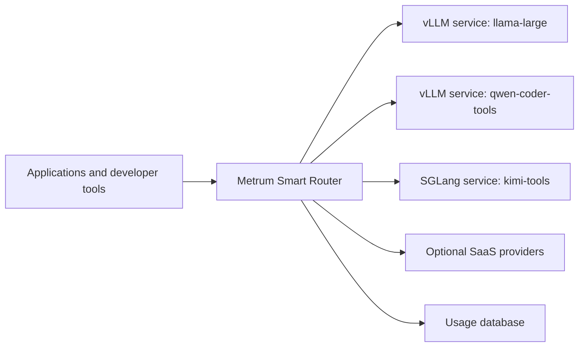

# Self-Hosted Upstreams

Metrum Smart Router can complement llm-d: configure the llm-d OpenAI-compatible
frontend as a private upstream, let Metrum Smart Router select the deployment-defined
model group, and let llm-d select a serving replica. The two policy layers are
independent; Metrum Smart Router does not install, configure, or control llm-d. The
`nvidia-llmd-compat` blueprint profile uses the in-cluster frontend
`llm-d-local-epp:8081` as a reference integration and must pass its own direct
upstream and router-level smokes before use.

Metrum Smart Router can sit inside an enterprise network and route to internally hosted inference services, including vLLM and SGLang deployments that expose OpenAI-compatible HTTP APIs. Applications continue to call one router endpoint and one set of governed model-group names, while platform teams keep GPU endpoints, model IDs, routing policy, caller allow lists, telemetry, and provider credentials server-side.

## Enterprise Shape



Typical enterprise deployments put the router behind the organization's TLS ingress and keep vLLM or SGLang services on private network names such as `http://vllm-llama70b.inference.svc.cluster.local:8000/v1`. The router can also mix internal services with external providers in one model group for migration, overflow, or fallback.

On file-owned installs, `metrum-genai-smartrouterctl providers upsert` and
`models upsert-group` can write those upstream endpoints and routing targets into
local `config.yaml`. For a full NVIDIA local-serving Kubernetes layout (multiple
in-cluster models plus router), render
`metrum-genai-smartrouterctl blueprint render` from
`deploy/kubernetes/intents/shadeform-nvidia-local-models.example.yaml` (L40S) or
`shadeform-nvidia-local-models-b200.example.yaml` (B200/H200) so generated
providers use only cluster Service DNS names.

On AMD Instinct clusters, use the manual
`k3s-amd-instinct-local-serving` overlay for vLLM/ROCm workloads. The same
in-cluster Service DNS and router model-group contract applies, serving Pods
request `amd.com/gpu`, and the router requests no GPU. The current blueprint
CLI does not emit the AMD overlay.

If the internal service requires a bearer token, set `auth_scheme: bearer` and load `api_key` from the deployment environment. If access is enforced entirely by network policy, mTLS, or a service mesh, omit `api_key`; the router will not add an upstream authorization header.

## Upstream Server Requirements

The upstream service must expose an OpenAI-compatible endpoint matching the configured router dialect:

| Router dialect | Upstream endpoint shape | Common use |
|---|---|---|
| `openai-chat` | `/v1/chat/completions` | vLLM or SGLang chat models, including tool-capable chat models |
| `openai-responses` | `/v1/responses` | Codex-style Responses clients when the upstream supports the Responses API |
| `anthropic` | Anthropic Messages-compatible API | Claude Code-compatible upstreams or provider skins |

vLLM documents OpenAI-compatible serving, including `/v1/models`, `/v1/chat/completions`, `/v1/responses`, `/health`, and `/metrics`. Its chat serving requires a model chat template; if the model does not ship one, start vLLM with `--chat-template`.

vLLM's OpenAI-compatible server accepts multimodal chat content for supported VLMs using OpenAI-style content parts such as `{"type":"image_url","image_url":{"url":"..."}}`. For production VLM deployments, configure vLLM media access controls such as `--allowed-media-domains` so the server cannot fetch arbitrary internal URLs.

SGLang supports OpenAI-compatible chat completions, multimodal language models, and a tool parser for models that need structured function-call parsing. Validate the exact image/video input shape for the model family you serve.

## vLLM Example

Start one vLLM service per served model or model family. Choose the parser and chat template for the actual model you run.

```bash
vllm serve Qwen/Qwen3-Coder-30B-A3B-Instruct \
  --host 0.0.0.0 \
  --port 8000 \
  --served-model-name qwen3-coder-tools \
  --api-key "${VLLM_QWEN_API_KEY}" \
  --enable-auto-tool-choice \
  --tool-call-parser qwen3_xml
```

Then register that service as a router provider:

```yaml
providers:
  vllm_qwen_tools:
    base_url: http://vllm-qwen-tools.inference.svc.cluster.local:8000/v1
    dialect: openai-chat
    auth_scheme: bearer
    api_key: ${VLLM_QWEN_API_KEY}
    api_key_env: VLLM_QWEN_API_KEY
    key_id: vllm-qwen-tools-prod
    models:
      qwen3-coder-tools:
        model: qwen3-coder-tools
        tier: coding
        input_price_per_million_usd: 0.00
        output_price_per_million_usd: 0.00
        input_modalities: [text]
        output_modalities: [text]
        pricing_notes: internal GPU allocation; set cost-allocation values if reports need allocated cost
        tool_support:
          openai_chat: [tools, tool_choice]

models:
  internal-coder:
    strategy: weighted
    targets:
      - provider: vllm_qwen_tools
        model_ref: qwen3-coder-tools
        weight: 100
      - provider: vllm_qwen_tools
        model_ref: qwen3-coder-tools
        weight: 100
        tool_only: true
```

For self-hosted models, set `input_price_per_million_usd` and `output_price_per_million_usd` to the enterprise cost-allocation rate if one exists. Use `0.00` only when reports should show token volume without allocated GPU cost. Set `tool_support` only after the direct upstream and router-level tool smokes pass for that exact served model, chat template, parser, and client protocol.

For self-hosted VLMs, also set `input_modalities` and `output_modalities` after direct image/video smokes pass. If image input has a separate cost-allocation rate, use `image_input_price_per_million_tokens_usd` for provider-reported image tokens or `image_input_price_per_image_usd` for fixed per-image accounting. The router logs image count, upstream image-token counts when reported, calculated image cost, and upstream-reported billed cost when the upstream includes it.

Example VLM catalog entry:

```yaml
providers:
  vllm_qwen_vl:
    base_url: http://vllm-qwen-vl.inference.svc.cluster.local:8000/v1
    dialect: openai-chat
    auth_scheme: bearer
    api_key: ${VLLM_QWEN_VL_API_KEY}
    api_key_env: VLLM_QWEN_VL_API_KEY
    key_id: vllm-qwen-vl-prod
    models:
      qwen-vl:
        model: qwen-vl
        tier: vision
        input_price_per_million_usd: 0.00
        output_price_per_million_usd: 0.00
        image_input_price_per_image_usd: 0.0005
        input_modalities: [text, image]
        output_modalities: [text]
        pricing_notes: internal GPU allocation plus per-image cost allocation

models:
  vision:
    strategy: weighted
    targets:
      - provider: vllm_qwen_vl
        model_ref: qwen-vl
        weight: 100
```

Direct VLM smoke before activating the route:

```bash
curl "$VLLM_QWEN_VL_BASE_URL/chat/completions" \
  -H "Authorization: Bearer $VLLM_QWEN_VL_API_KEY" \
  -H "Content-Type: application/json" \
  -d '{
    "model": "qwen-vl",
    "messages": [{
      "role": "user",
      "content": [
        {"type": "text", "text": "Read the receipt. Reply with only the merchant name."},
        {"type": "image_url", "image_url": {"url": "https://cdn.learnopencv.com/wp-content/uploads/2018/06/04100007/receipt.png"}}
      ]
    }],
    "max_tokens": 64,
    "stream": false
  }'
```

Callers still request the router model group, not the upstream service model:

```bash
curl "$ROUTER_BASE_URL/v1/chat/completions" \
  -H "Authorization: Bearer $ROUTER_TOKEN" \
  -H "Content-Type: application/json" \
  -d '{
    "model": "internal-coder",
    "messages": [{"role": "user", "content": "Write a short hello-world function."}],
    "max_tokens": 200,
    "stream": false
  }'
```

## SGLang Example

Start SGLang with the parser that matches the model. For Qwen 2.5-style tool calls:

```bash
python3 -m sglang.launch_server \
  --model-path Qwen/Qwen2.5-7B-Instruct \
  --host 0.0.0.0 \
  --port 30000 \
  --tool-call-parser qwen25
```

Router config:

```yaml
providers:
  sglang_qwen_tools:
    base_url: http://sglang-qwen-tools.inference.svc.cluster.local:30000/v1
    dialect: openai-chat
    auth_scheme: bearer
    api_key: ${SGLANG_QWEN_API_KEY}
    api_key_env: SGLANG_QWEN_API_KEY
    key_id: sglang-qwen-tools-prod
    models:
      qwen25-tools:
        model: Qwen/Qwen2.5-7B-Instruct
        tier: balanced

models:
  internal-tools:
    strategy: weighted
    targets:
      - provider: sglang_qwen_tools
        model_ref: qwen25-tools
        weight: 100
      - provider: sglang_qwen_tools
        model_ref: qwen25-tools
        weight: 100
        tool_only: true
```

## Tool Calls Through Self-Hosted Models

For OpenAI-compatible chat requests, the router forwards `tools`, `tool_choice`, `parallel_tool_calls`, tool-result messages, and related Chat Completions fields to an `openai-chat` upstream target. This is the compatibility path used by OpenAI-compatible agents such as Warp Agent. Tool-bearing OpenAI Chat requests only route to targets with explicit `tool_support.openai_chat`. The upstream model decides whether to return a tool call. The router does not execute the tool. The client or agent runtime executes the function and sends the tool result back in the next request.

Example request through the router to a tool-enabled internal vLLM or SGLang target:

```bash
curl "$ROUTER_BASE_URL/v1/chat/completions" \
  -H "Authorization: Bearer $ROUTER_TOKEN" \
  -H "Content-Type: application/json" \
  -d '{
    "model": "internal-tools",
    "messages": [{"role": "user", "content": "What is the weather in San Francisco?"}],
    "tools": [{
      "type": "function",
      "function": {
        "name": "get_weather",
        "description": "Get weather for a city.",
        "parameters": {
          "type": "object",
          "properties": {
            "location": {"type": "string"},
            "unit": {"type": "string", "enum": ["celsius", "fahrenheit"]}
          },
          "required": ["location", "unit"]
        }
      }
    }],
    "tool_choice": "auto",
    "stream": false
  }'
```

For streaming OpenAI Chat clients, repeat the same request with `"stream": true`
and verify that the upstream receives native streaming. The downstream SSE
should contain incremental `delta.tool_calls`, terminal
`finish_reason: "tool_calls"`, and a final usage event when the caller sends
`stream_options.include_usage: true`. Compatible `stream_options` are
forwarded to the selected target. Canceling the caller request cancels the
upstream call; after the first native event is written, the router does not
retry, replay, or fall back to another target. Same-dialect OpenAI Responses
streaming also proxies native upstream SSE. Cross-dialect bridges continue to
use unary upstream calls with router-encoded caller streaming.

Expected shape when the model chooses the tool:

```json
{
  "choices": [{
    "message": {
      "role": "assistant",
      "tool_calls": [{
        "type": "function",
        "function": {
          "name": "get_weather",
          "arguments": "{\"location\":\"San Francisco\",\"unit\":\"fahrenheit\"}"
        }
      }]
    }
  }]
}
```

Some upstream models support named or required tool choice better than automatic tool choice. vLLM documents named, `auto`, `required`, and `none` tool-choice modes; SGLang documents `required` and named function tool-choice support with the default Xgrammar backend. Validate the exact model, parser, chat template, streaming mode, and tool-choice setting before adding a self-hosted target to a production tool route.

## Structured Outputs

For OpenAI-compatible chat services, declare structured-output support only after the upstream accepts Chat Completions `response_format` with the schema subset your clients use and the same request passes through the router. For Responses-compatible services, validate `/v1/responses` with `text.format` separately before declaring `tool_support.openai_responses: [structured_outputs]`.

```yaml
tool_support:
  openai_chat: [tools, tool_choice, structured_outputs]
```

Structured-output support is not inferred from vLLM, SGLang, model-card, or provider marketing claims. It depends on the exact served model, server version, parser/chat template, dialect, and client request shape. The router forwards the schema payload to the upstream; it does not validate arbitrary JSON Schema subsets or repair nonconforming model output. If a structured-output smoke starts failing, remove `structured_outputs` from the provider model metadata or remove the target from active groups until the upstream behavior is fixed.

## Validation Checklist

Before allowing production traffic to a self-hosted upstream:

- Confirm the upstream `/v1/models` ID matches `providers.<name>.models.<ref>.model`.
- Run a direct upstream text smoke against `/v1/chat/completions`.
- For VLM targets, run a direct image smoke and then the same image request through the router. Add `image` to `input_modalities` after both pass.
- Run a direct upstream tool smoke with the exact tool schema and `tool_choice` mode clients will use.
- Run the same text and tool smoke through the router model group.
- Run direct upstream and router-level structured-output smokes for every dialect that claims `structured_outputs`.
- Run a combined tool plus structured-output smoke when a target claims both capabilities for the same dialect.
- Mark tool-capable targets with `tool_only: true` when they should be used only for tool-bearing requests.
- Keep non-tool and tool traffic in separate targets if a model is strong for text but unreliable for tools.
- Monitor upstream latency, error rate, output-token throughput, and cache bypasses in router usage reports and metrics.

Upstream references:

- [vLLM online serving](https://docs.vllm.ai/en/latest/serving/online_serving/)
- [vLLM multimodal inputs](https://docs.vllm.ai/en/stable/features/multimodal_inputs/)
- [vLLM tool calling](https://docs.vllm.ai/en/latest/features/tool_calling/)
- [SGLang multimodal language models](https://docs.sglang.io/docs/supported-models/multimodal_language_models)
- [SGLang tool parser](https://docs.sglang.io/docs/advanced_features/tool_parser)
