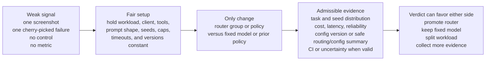

# Prove Router Quality

Use this playbook when a team asks whether a routed model group works as well as a fixed model, a previous routing policy, or another provider mix. A routing decision is a claim. Claims need measurable, repeatable evidence.

The right answer is not always "the router wins." The right answer is knowing which model group or fixed model is good enough for which workload at which cost, latency, and reliability envelope. If the evidence says a workload needs a stronger target, the deployment can promote that target, add a workload-specific group, change weights, or route only that workload differently.

## Executive Framing

Anecdotes are useful bug reports. They are not sufficient evidence for changing production routing policy by themselves.

Compare a router group against a fixed model or previous-policy control with the workload, client, agent, tools, prompt shape, seed policy, versions, token caps, timeouts, and scoring held constant. Change only the model selection: routed group versus fixed model, or new policy versus previous policy.

Teams own their routing destiny. GenAI Smart Router makes routing policy controllable, measurable, and reversible; it does not guarantee every workload improves automatically. Use evidence to decide whether to promote a routed group, keep a fixed model, split the workload, or collect more data before rollout.

## Admissible Evidence

| Anecdote / weak signal | Evidence / strong signal |
|---|---|
| "it felt dumber today" | fixed task set, pinned versions, repeated runs |
| one screenshot | saved test cases with expected outcomes |
| one cherry-picked failure | distribution across tasks/seeds/users |
| no config/version record | config version or safe routing/config summary |
| no control | fixed-model baseline or previous-policy baseline |
| no metric | pre-registered pass rate, cost, latency, or business metric |

Smoke tests prove compatibility for a narrow request shape. Offline evaluations prove outcome quality on a fixed dataset. Shadow tests show how a candidate policy behaves on production-like traffic without changing user experience. A/B tests compare production cohorts when the risk is acceptable and the business metric is defined before the run.

## Router Vs Fixed-Model Template

Use this template before running the comparison:

| Field | What to record |
|---|---|
| Hypothesis | Example: `<router-group>` matches `<fixed-model>` pass rate while reducing cost or latency. |
| Workload/task set | Dataset, task IDs, product flow, or acceptance-test suite. |
| Metric and success threshold | Pass rate, reward, resolution rate, extraction accuracy, business metric, cost, latency, or reliability threshold. |
| Baseline/control model | Fixed model ID or previous routing policy. Mark IDs as deployment examples when not validated for the current deployment. |
| Candidate router group or policy | Deployment-defined model group, target weights, scripted policy label, config version, or safe routing/config summary. |
| Client/agent version | SDK, CLI, application build, agent version, and evaluator version. |
| Tool/image/structured-output/reasoning settings | API shape, tools, modalities, schemas, reasoning/thinking controls, and eligibility expectations. |
| Seeds/attempts | Number of runs, seed policy, retry policy, and whether tasks are independent. |
| Token caps/timeouts | `max_tokens`, `max_output_tokens`, request timeout, per-attempt timeout, and agent timeout. |
| Routing config version or safe routing/config summary | Enough safe config detail to rerun without exposing provider keys, router tokens, token hashes, private URLs, or full production config. |
| Provider/model entitlement state | Whether the account was entitled to every compared model during the run. |
| Statistical comparison method | Distribution table, confidence interval, paired test, bootstrap, or other method appropriate for the metric and sample design. |
| Rollout decision | Promote, hold, split, rollback, or collect more evidence. |

Where statistics are used, keep the claim precise. Confidence intervals and p-values depend on task independence, sample design, metric choice, and whether the comparison is paired.

## Harbor Coding-Agent Example

Harbor is one useful coding-agent evaluation harness because it runs the agent loop and checks the produced artifact with a verifier. It is not required. Any objective verifier that matches the workload can be used. See the [Harbor Case Study](./harbor-case-study) for source-dated Harbor and Terminal-Bench context plus a worked production snapshot.

The model IDs below are placeholders. Replace them with model groups and fixed-model IDs validated for your deployment. The intended difference between A and B is only `--model` or route selection.

```bash
# Install Harbor in an isolated tool environment.
uv tool install harbor

# A: routed group
harbor run -d <dataset-or-task> \
  --agent <agent> \
  --model <router-model-group>

# B: fixed model control
harbor run -d <dataset-or-task> \
  --agent <agent> \
  --model <fixed-model-id>
```

Use the same Harbor-supported attempt and seed policy for both arms. Report the task-level reward or pass/fail result, agent errors, elapsed time, selected provider/model, retries, fallbacks, token counts, request-time cost, and throughput for both arms. Join the Harbor run window to router usage reports by timestamp, caller/project, client, model group, request ID, or run label.

## Outcome Gate Artifact

For production route changes, convert the run matrix and workload results into an explicit gate artifact before promotion. In a source checkout, use the repository evaluator to summarize Harbor `results.tsv` files or JSON result rows and merge safe usage-report rows when available. Packaged deployments should run the same workflow from the deployment's approved validation environment; the router release binaries do not include a separate `workload-gate` executable.

```bash
python3 scripts/evaluate_workload_gate.py \
  --matrix examples/harbor-algotune-pca/workload_gate_matrix.json \
  --results examples/harbor-algotune-pca/runs/<CASE_ID>/results.tsv \
  --usage-json examples/harbor-algotune-pca/reports/<CASE_ID>/usage-rows.json \
  --out-json examples/harbor-algotune-pca/reports/<CASE_ID>/workload-gate.json \
  --out-md examples/harbor-algotune-pca/reports/<CASE_ID>/workload-gate.md
```

The matrix should declare the task set, reward/verifier, clients, model groups, attempts/seeds, fixed-model or previous-policy controls, pass-rate and reward thresholds, p95 latency ceiling, cost-per-success ceiling, error and fallback ceilings, and rollback criteria. For local or CI environments where live Harbor is not installed, use a mock fixture self-test in the deployment's approved validation workflow.

The gate report is safe to share when populated from safe result and usage rows: it includes task/run counts, pass rate with confidence interval, reward, cost, latency, fallback/error rates, selected upstream distribution, and request IDs. It intentionally excludes raw router tokens, token hashes, provider keys, prompts, images, tool outputs, and full deployment config.

## Non-Harbor Examples

| Workload | Objective evidence |
|---|---|
| Support-chat answer rubric | Score a fixed set of tickets with expected facts, forbidden claims, tone requirements, and escalation rules. |
| Extraction accuracy on a golden dataset | Compare exact-match, field-level F1, invalid JSON rate, and cost per accepted record. |
| OCR target answer validation | Ask for a specific receipt merchant, invoice total, or form field and compare against the expected answer. |
| Browser-control task success | Run a fixed browser task and score whether the final page state, form value, or downloaded artifact is correct. |
| OpenAI Chat tool-call correctness | Assert the selected tool name, arguments, forced/auto `tool_choice` behavior, and final answer. |
| Responses function-call continuation | Assert function-call output is accepted and the continuation reaches the expected final answer. |
| Anthropic Messages client-tool task | Assert client tool calls have the expected shape and the final tool-result continuation succeeds. |
| Internal app acceptance tests | Run product tests that already represent user success, then compare route, cost, latency, and errors. |
| Production shadow or A/B cohort | Use when appropriate governance exists; pre-register the cohort, metric, guardrails, and rollback rule. |

## Metrics To Report

Include enough data for a skeptical reviewer to rerun or challenge the result:

| Metric class | Required evidence |
|---|---|
| Primary outcome | Pass rate, reward score, resolution rate, acceptance-test result, or business success metric. |
| Cost | Actual request-time upstream input and output token usage, image cost fields where relevant, cache cost where relevant, and comparison against the baseline. |
| Latency | Downstream latency, upstream duration, TTFB where available, output tokens/sec, and total tokens/sec. |
| Reliability | Retries, fallbacks, provider errors, `no-eligible-target`, timeout, cancellation, and agent/runtime errors. |
| Compatibility | API shape, tool dialect, modality, structured-output behavior, reasoning/thinking controls, and cap forwarding. |
| Distribution | Task-level and seed-level results, not only one aggregate. |
| Uncertainty | Confidence interval or uncertainty estimate when sample size and metric design allow it. |

Reports should sum stored request-time cost values. Do not reprice historical actuals from current provider config.

## Decision Matrix

| Evidence result | Decision |
|---|---|
| Router group beats fixed model | Promote or increase access, then continue monitoring outcome, cost, latency, and error budgets. |
| Router group ties fixed model at lower cost or better latency | Promote cautiously, retain rollback criteria, and monitor production distribution. |
| Router group underperforms | Keep the fixed model, create a workload-specific group, increase stronger target weight, or adjust capability filters. |
| Mixed results | Split by task category, model group, request shape, user/project, or policy label. |
| Evidence inconclusive | Gather more tasks/seeds, improve the rubric, or use shadow mode before production rollout. |

## Prove It, Do Not Feel It: Auditing a Smart Router Against a Fixed Model



The visual is maintainable Mermaid markup that ships with the page. The audit rule is simple: publish enough safe evidence for another reviewer to understand what changed, what stayed constant, how outcomes were scored, and why the rollout decision follows from the data.

## Safe Proof Package

Share safe artifacts: task IDs, expected outcomes, scorer version, client/agent version, model group, fixed-model control, config version or safe routing/config summary, timestamps, request IDs, selected provider/model, token counts, cost, latency, fallback/error counts, and anonymized aggregate tables.

Do not share provider keys, bearer tokens, token hashes, raw prompts, raw images, raw tool outputs, private repository contents, private hostnames, or full production config unless a governed support path explicitly permits it.
