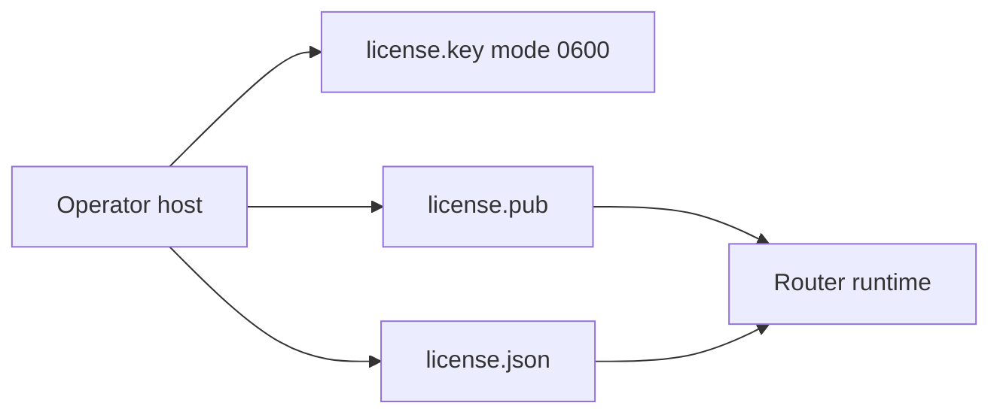

# Self-Managed Licensing

All Metrum Smart Router first-party content is licensed under Apache-2.0. In this
section, "license" refers only to an optional operator-created runtime policy
file. It is not a copyright license or commercial-use condition and does not
narrow the rights granted by Apache-2.0.

Signed-license enforcement is off by default (`server.license.enabled: false`).
A normal build and run need no license file; all OSS router features stay
available. Operators who want runtime policy gates may opt in by enabling a
locally signed, self-managed license.

When enabled, the deployment wrapper creates an Ed25519 keypair on the operator
host when one does not already exist, issues `license.json`, and mounts only the
public key plus license into the router runtime.

## What Operators Keep

Keep these files outside source control and outside Kubernetes:

```text
license.key      # mode 0600; signing key; operator host only
license.key.pub  # base64 verification key
```

The router receives `license.json` and `license.pub` in its runtime Secret:

```yaml
server:
  license:
    enabled: true
    path: /app/config/license.json
    state_path: /app/state/license-state.json
    public_keys:
      - key_id: self-managed
        path: /app/config/license.pub
```



Private signing keys stay on the operator host. They are not copied into
containers, Kubernetes, logs, or this repository.

## Issue A Runtime License

Use the packaged `metrum-genai-smartrouter-license` (or `go run ./cmd/metrum-genai-smartrouter-license` from a source checkout). Operator-generated keys are not embedded in release binaries, so `issue` needs `--allow-unknown-runtime-key` plus `--public-key`.

A local trial can run [Local Quickstart](/docs/getting-started/local-quickstart) instead of these flags. For a manual issue:

```bash
metrum-genai-smartrouter-license generate-keypair \
  --public-key-out license.pub \
  --private-key-out license.key

metrum-genai-smartrouter-license issue \
  --catalog docs/enterprise-license-skus.json \
  --entitlement docs/entitlement.local-dev.example.json \
  --key license.key \
  --public-key license.pub \
  --allow-unknown-runtime-key \
  --valid-for 8760h \
  --out license.json

metrum-genai-smartrouter-license verify \
  --license license.json \
  --public-key license.pub

metrum-genai-smartrouter-license safe-summary \
  --license license.json
```

`docs/entitlement.local-dev.example.json` uses SKU `oss-self-managed` and
`signing.key_id: self-managed`. It is a generic example, not a customer
payload. Production entitlements stay in operator-protected storage.

## Automated Helm Installation

Use the generated deployment wrapper when you choose to enforce a signed
runtime license. It generates a local keypair on first use, issues a license
with the requested validity, atomically refreshes the runtime Secret, and
installs or upgrades Helm:

```bash
scripts/helm_install_with_license.sh \
  --kubeconfig "$KUBECONFIG" \
  --namespace smart-llmrouter \
  --release smart-llmrouter \
  --chart /path/to/charts/smart-llmrouter \
  --entitlement /protected/entitlement.json \
  --valid-for 8760h \
  --config /protected/config.yaml \
  --env-file /protected/env.json \
  --image-repository smart-llmrouter \
  --image-tag <immutable-tag>
```

Use `--license-key` and `--license-public-key` to reuse a keypair stored at a different protected local path.

## Rotation and Recovery

Do not edit `license.json`. Generate a replacement license with the same keypair for normal renewal, or generate a new keypair and update both `license.json` and `license.pub` together when rotating trust. Back up the private key securely; loss of that key requires trust rotation and a replacement license.

## Safe Status

Operators can inspect safe status fields including license ID, key ID, expiry, enabled features, and limit status. The router never exposes private signing keys, provider keys, caller tokens, raw signatures, or full runtime configuration through ordinary APIs.
