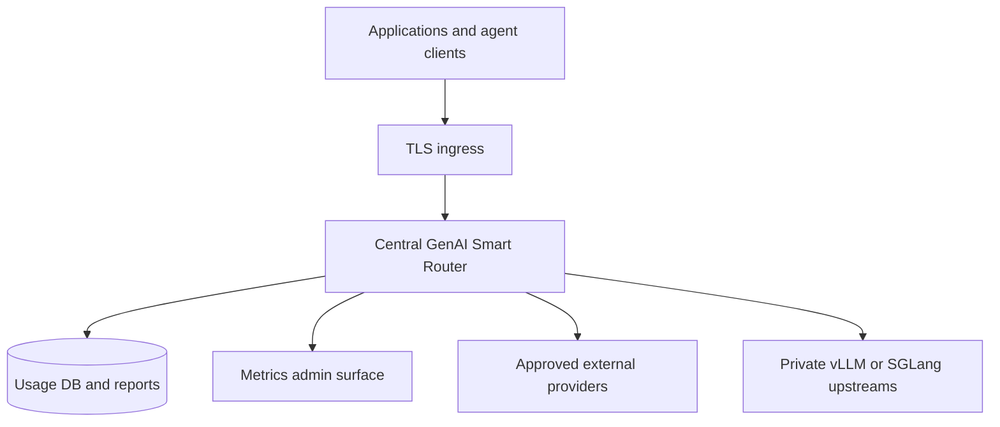
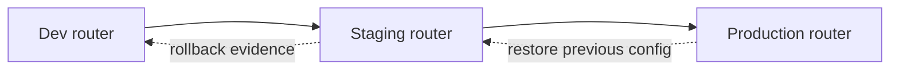
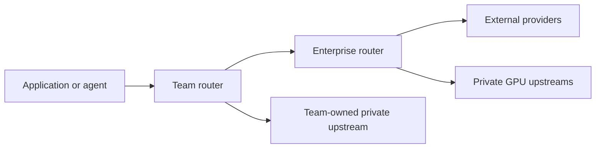

# Enterprise Deployment Patterns

GenAI Smart Router is deployment-owned infrastructure. Enterprises can run it as enterprise self-hosted infrastructure, a private managed dedicated deployment, or a hosted evaluation endpoint while they prove client compatibility and model-group quality.

Model groups, provider credentials, private upstreams, caller access, telemetry retention, and routing strategy are deployment-defined. The product principle is that the customer or operating team owns its routing destiny. The router supplies the control surface, compatibility layer, evidence, and enforcement points so teams can evolve provider/model choices without rewriting every client.

From Operations, you might be looking for install paths: see [Docker Compose](../installation/docker-compose), [Kubernetes](../installation/kubernetes), or [Binary Installation](../installation/binary).

For installation mechanics and deployment-shape selection, see [Installation](../installation/). For licensing and commercial paths, see [Choose a Deployment Path](../licensing/deployment-paths).

## Pattern A: Metrum-Managed Evaluation Endpoint

Use a Metrum-managed evaluation endpoint when the fastest proof is more valuable than standing up customer infrastructure first.

Best fit:

- quick OpenAI Chat, OpenAI Responses, Codex CLI, Anthropic Messages, or Claude Code compatibility checks;
- model-group quality proof against real workload samples;
- spend, latency, provider/model mix, and fallback report evidence;
- pilot handoff before a self-hosted or private managed production deployment.

The evaluator receives a deployment-specific base URL, router token, and allowed model groups. Any example group names are hosted/reference examples only; `/v1/models` is the caller-facing source of truth for the groups allowed to that caller token.

Acceptance evidence to request:

- `/v1/models` output for the evaluation token;
- one `/v1/chat/completions` smoke;
- one OpenAI Responses or Codex CLI smoke;
- one Anthropic Messages or Claude Code smoke when that client matters;
- one report excerpt showing provider/model, latency, tokens, cost, status, attempts, and fallback behavior;
- one security and retention summary covering provider-key handling, diagnostics redaction, metrics-admin isolation, and content-retention policy.

This pattern is for hosted evaluation or a contracted private managed service. Customer access, retention, provider custody, and report boundaries are defined by that deployment agreement.

## Pattern B: Enterprise Self-Hosted Central Gateway

Use one central router deployment per enterprise environment, VPC, or network trust boundary when the platform team owns GenAI access for many applications.

Apps call the router instead of provider APIs. The central platform team owns provider credentials, caller tokens, model-group access, metrics-admin isolation, retention policy, and the license file. Teams request allowed groups, and the platform tunes targets, weights, fallbacks, and validation metadata behind those groups.

This pattern works well when provider keys must stay server-side, private upstreams must remain on protected networks, and FinOps or platform operations need cost-allocation reports across teams.

## Pattern C: Per-Environment Routers

Use separate dev, staging, and production routers or configs when provider activation and weight changes need a promotion path.

Keep test provider keys separate from production BYOK credentials where policy requires it. Use separate usage databases or state stores when the reporting, retention, or license envelope differs by environment. Validate new providers, model IDs, weights, tool metadata, image metadata, and routing scripts in staging before promotion.

### Multi-environment operator contract

In binary tarballs, `metrum-smartrouterctl` keeps a non-secret relational inventory of tenant/router instances and their explicit dedicated database allocation IDs. The CLI is not included in the standard Docker or Docker Compose image; Docker-based operators run it from an extracted binary package on a separate trusted administration host. Stage labels are deployment-defined rather than a fixed environment list. Registration requires separate expected and independently observed current schema versions. Repeating an unchanged registration after an observation remains idempotent and preserves the stored current version and observation time, while immutable contract conflicts fail closed. A later local-only `observe-schema` command updates only the current version and server-generated observation time for exactly one tenant/stage; expected deployment metadata remains immutable. Missing, ambiguous, malformed, or out-of-range observations fail closed. A bounded read-only status reports `schema_version_mismatch` or `current` without contacting a live database, cluster, DNS endpoint, cloud API, adapter, or secret store.

Schema observation opens only an existing local registry. A missing registry
fails closed without creating a SQLite file or applying registry DDL.

This safe slice permits only fake-adapter quota admission checks and local registry records. It rejects shared database placement and keeps RDS Proxy disabled. Deploy, promotion, rollback, cleanup, and all cloud/Kubernetes/DNS actions are disabled pending approved endpoint, encryption, TLS, backup/durability, HA, network, and DNS policy. Operators should treat a local quota admission record as planning evidence, not as a reservation made with a cloud provider.

The fake-adapter `quota-reserve` command accepts only a bounded opaque
`rsv-<lowercase-canonical-uuid>` idempotency key. It rejects token-like,
credential-like, URL, path, uppercase, malformed, and unbounded values before
calling the quota adapter or writing a quota-admission record. An exact retry
of a bounded opaque legacy row already in the local registry remains
idempotent only for the historically evidenced `reserve-<lowercase-opaque-suffix>`
and `legacy-<lowercase-opaque-suffix>` namespaces. This strict allow-list
rejects provider- and deployment-credential-shaped legacy rows without
returning their identifiers. A legacy identifier cannot create a new hold and
a different identifier cannot bypass an active hold.

Rollout and rollback flow:

1. Update staging config and run `/readyz`, `/v1/models`, Chat, Responses, Messages, tool, image, report, and license smokes that match the change.
2. Capture provider/model selection, status, latency, usage, and request IDs for the test window.
3. Promote the reviewed config or package to production with a timestamped backup.
4. Repeat the same post-promotion smokes.
5. Roll back by restoring the previous package/config/license input and rerunning the failed smoke.

## Pattern D: Per-Team Or Per-Business-Unit Routers

Use separate router instances for teams that need independent provider keys, cost centers, retention policy, private upstreams, release cadence, or regional controls.

Caller users, projects, environments, and caller tokens map to reporting and access. A single team router can expose multiple model groups for that team's workloads, and reports can still separate usage by caller, project, client, model group, provider/model, latency, cost, and status.

Model group names are deployment-defined. Do not bake example names such as `default`, `fast`, `high`, `big-coder`, or `vision` into application logic as product constants. Clients should discover allowed groups with [`/v1/models`](../getting-started/available-models) for their token.

## Pattern E: Hierarchical Or Federated Routers

Hierarchical and federated topologies are supported conceptually through standard API boundaries, even when there is not one turnkey config that defines every enterprise variant. A team router can call a central enterprise router as an upstream OpenAI-compatible service, or multiple team routers can sit behind central ingress and governance.

Useful cases:

- central enterprise policy with team-local model-group strategy;
- regional or data-residency routers that forward only eligible traffic;
- a private GPU router exposed as an upstream to a central router;
- migration from a Metrum-managed pilot to customer-owned production;
- blue/green or canary router instances.

Responsibility boundaries:

- store upstream-router auth tokens only in the downstream router's protected environment or secret manager;
- define model-group access at each hop, because the app's token and the downstream router's upstream token are separate trust decisions;
- propagate or record request IDs so reports can be correlated across hops without storing prompts or responses;
- budget timeouts across the full path so one hop does not consume all caller patience;
- avoid prompt, image, response, or tool-output capture unless a governed content-capture policy explicitly enables it;
- keep `/metrics` restricted to metrics-admin subjects and do not add tenant data labels to unauthenticated or ordinary-caller endpoints.

For hierarchical production readiness, test authentication, model access, request ID correlation, timeout budgets, failure behavior, and reporting at every hop before shifting real traffic.

## Pattern F: Private Managed Dedicated Deployment

Use a private managed dedicated deployment when one customer wants a dedicated router instance operated for them instead of running the service themselves.

One customer or contracted customer environment maps to one dedicated deployment. Provider-cost handling, BYOK scope, network isolation, reporting, retention, and acceptance tests are defined in the managed-service plan. Store private operational hostnames, SSH procedures, token files, and operating procedures in the customer's approved private operations system.

See [Choose a Deployment Path](../licensing/deployment-paths), [Enterprise Private Managed](../licensing/enterprise-private-managed), and [License-Protected Deployments](./license-protected-deployments).

## Pattern Selection Table

| Concern | Recommended pattern | Proof to request | Operational owner |
|---|---|---|---|
| Data residency | Per-environment, per-region, or federated routers | Region-specific routing policy, provider/upstream inventory, report scope, and failure test | Platform plus regional compliance owner |
| BYOK | Self-hosted central gateway or private managed dedicated deployment | Provider-key custody summary and one caller smoke that never exposes upstream keys | Customer platform or managed-service operator |
| Private upstreams | Self-hosted central gateway, per-team router, or federated private GPU router | Direct upstream smoke, router-level smoke, network boundary summary, and rollback plan | Platform or owning ML infrastructure team |
| Cost attribution | Central gateway or per-team routers | Usage/report excerpt grouped by caller, project, model group, provider/model, tokens, latency, and cost | Platform FinOps or team operations |
| Evaluation speed | Metrum-managed evaluation endpoint | `/v1/models`, Chat, Responses/Codex, Messages/Claude Code, report excerpt, and retention summary | Metrum evaluation operator plus customer evaluator |
| Central governance | Enterprise self-hosted central gateway | Caller allow-list test, metrics-admin isolation, report-admin authorization, and license status | Enterprise platform team |
| Team autonomy | Per-team routers or hierarchical routers | Team-local model group config, team report excerpt, and central policy compatibility smoke | Team platform owner with central governance review |
| DR/region | Per-environment or federated routers | Backup/restore, regional failover, timeout, and rollback tests | Platform SRE |
| Compliance/audit | Self-hosted central gateway, per-environment routers, or private managed dedicated deployment | Security assessment, retention summary, admin/report authorization test, and sanitized diagnostics review | Security, compliance, and platform operations |
| Heavy coding-agent workloads | Central, per-team, or hierarchical routers with validated agent groups | Codex/Claude Code file-edit smoke, tool-call evidence, model-group quality contract, latency/cost report | Developer platform or AI engineering team |

## What To Test Before Production

Run the smokes that match the selected pattern and the API shapes clients will actually use.

Core production checklist:

- `/readyz` and `/version`;
- `/v1/models` with each caller class;
- OpenAI Chat text request;
- OpenAI Responses request and Codex CLI smoke when Responses clients are in scope;
- Anthropic Messages request and Claude Code smoke when Messages clients are in scope;
- OpenAI Chat, Responses, or Anthropic tool-call smoke for every claimed tool dialect;
- image/VLM smoke for groups that accept image input;
- usage/report excerpt for the test window;
- license status and one licensed-feature smoke for licensed deployments;
- backup/restore of config, state, license state, and usage DB according to the deployment policy;
- rollback to the previous package or config and rerun of the failed smoke.

For hierarchical deployments, also test:

- request ID propagation or report-correlation fields across hops;
- timeout budget across app, team router, enterprise router, and upstream provider;
- authentication at both router hops;
- model-group access at both hops;
- failure behavior when the upstream router returns `401`, `403`, `429`, timeout, `no-eligible-target`, or provider failure.

## Related Docs

- [Deployment Readiness](../evaluation/deployment-readiness)
- [Evaluate GenAI Smart Router](../evaluation/evaluate-smart-router)
- [Model Group Quality Criteria](../evaluation/model-group-quality)
- [Self-Hosted Upstreams](../configuration/self-hosted-upstreams)
- [Usage Reporting](./usage-reporting)
- [Admin Browser Reports](./admin-browser-reports)
