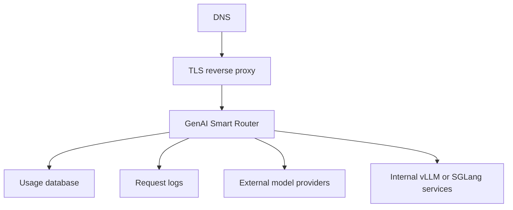

# Deployment

GenAI Smart Router can be deployed as a compiled Linux binary or as a Docker Compose package. Release binaries embed this documentation site, so the router can serve product docs at `/` without a separate web server.

<div class="contactBanner">
  <p>For deployment planning, TLS setup, or managed rollout, contact <a href="mailto:contact@metrum.ai">contact@metrum.ai</a>.</p>
</div>

For package installation steps, see [Installation](../installation/). For release-to-release rollout sequencing, see [Upgrade Guide](../release-notes/upgrade-guide).

## Deployment Packages

Normal customer deployments use shipped release packages. The target host does not need the source tree, Go toolchain, Node.js, or Docusaurus build tools.

Choose the package that matches the host CPU architecture:

| Host architecture | Binary package | Docker Compose package |
|---|---|---|
| Intel/AMD Linux servers, `amd64`, `x86_64`, and common EC2 x86 instances | `smart-llmrouter-<version>-linux-amd64.tar.gz` | `smart-llmrouter-<version>-docker-linux-amd64.tar.gz` |
| ARM64 Linux servers, including AWS Graviton | `smart-llmrouter-<version>-linux-arm64.tar.gz` | `smart-llmrouter-<version>-docker-linux-arm64.tar.gz` |

Docker Compose packages include a prebuilt image tarball named `images/smart-llmrouter-<version>-linux-<arch>.tar`. After loading that image, set `SMART_LLMROUTER_VERSION` in `compose/.env` to the matching image tag, such as `<version>-linux-amd64` or `<version>-linux-arm64`. The value must match the loaded package architecture and must not be `latest`.

## Typical Production Shape



## Runtime Inputs

| Input | Purpose |
|---|---|
| Router config | Providers, model groups, caller tokens, limits, cache, usage store |
| Provider key environment | Upstream provider credentials loaded server-side, including internal vLLM/SGLang bearer tokens when required |
| Routing script | Optional TypeScript policy plus packaged helper/dependency files |
| Usage database | Durable reporting and cost-management data |

Docker Compose packages pin the router container with `SMART_LLMROUTER_VERSION` and require explicit Postgres credentials in `compose/.env`. Set `POSTGRES_PASSWORD` to a strong random value and use the same value in `ROUTER_USAGE_DB_DSN`; missing values cause `docker compose config` to fail before deployment. The packaged Postgres service is internal-only by default. If an operator needs host-side database access for administration, use the packaged localhost override so the database binds to `127.0.0.1`, not the public host interface.

Enterprise deployments often route to internally hosted vLLM or SGLang services. Configure each service as an OpenAI-compatible provider with a private `/v1` base URL, keep its access token in the deployment environment, and expose only router model groups to callers. Validate each internal upstream directly and through the router before adding it to a production model group.

Configure `server.upstream` with reviewed timeout and response-size limits for the deployment. The router does not follow upstream redirects, bounds successful upstream response bodies with `max_response_bytes`, and blocks image URLs that resolve to private or reserved addresses unless `allow_private_image_urls: true` is explicitly set for a reviewed private VLM design.

TypeScript routing scripts are loaded from the deployment filesystem. Package local helper imports and any locked third-party dependencies with the script directory, or deploy a pre-bundled script artifact. The router does not install npm packages at runtime.

Licensed deployments mount the Metrum-issued `license.json` into the router config directory and enable `server.license`. Keep the license state file in the state directory so renewals, grace state, and clock rollback checks survive restarts. The router writes license and quota state with integrity metadata and private file modes; restore state files from trusted backups rather than editing counters by hand. Legacy unsigned quota-state import is an explicit one-time migration using `SMART_LLMROUTER_ALLOW_UNSIGNED_STATE_MIGRATION=1`, followed by restart without that flag after signed state is written. Renewal is replacing the license file and restarting the router or waiting for the configured recheck interval. Private signing keys are never needed by the deployed router.

External routing-policy calls are controlled by model-group config. For TypeScript policies, enable `script_http` only for groups that need it, list exact allowed service hosts, keep timeout and response-size limits small, and put policy-service auth in env-expanded config headers rather than script files. For standalone policy services, use `strategy: external` with `external_policy.url`, exact `allow_hosts`, low timeouts, response-size limits, and config-owned auth headers. HTTPS is the default for non-local policy services; use `script_http.allow_http` or `external_policy.allow_http` only for approved trusted internal endpoints. Redirects are revalidated and cannot escape the exact host allowlist.

## Browser And API Behavior

The router serves embedded docs for browser traffic at `/`. Every docs page displays the running binary version and full UTC build timestamp. Docs responses also include `X-Smart-LLMRouter-Version` and `X-Smart-LLMRouter-Build-Date` headers.

Router-owned operational endpoints expose runtime build metadata for load balancers and administrators:

```bash
curl https://llm-api.example.com/version
curl https://llm-api.example.com/readyz
```

API paths keep precedence:

- `/v1/*`
- `/metrics` for caller subjects authorized for `metrics` `read`
- `/healthz`
- `/readyz`

This makes a hosted router self-documenting without changing OpenAI-compatible client API response bodies.
