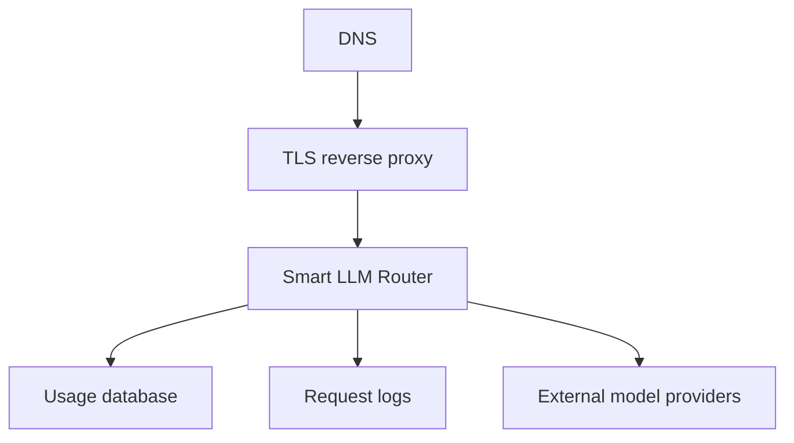

# Deployment

Smart LLM Router can be deployed as a compiled Linux binary or as a Docker Compose package. Release binaries embed this documentation site, so the router can serve product docs at `/` without a separate web server.

  
For deployment planning, TLS setup, or managed rollout, contact <a href="mailto:contact@metrum.ai">contact@metrum.ai</a>.

## Typical Production Shape

## Runtime Inputs

| Input | Purpose |
|---|---|
| Router config | Providers, model groups, caller tokens, limits, cache, usage store |
| Provider key environment | Upstream provider credentials loaded server-side |
| Routing script | Optional TypeScript policy |
| Usage database | Durable reporting and cost-management data |

## Browser And API Behavior

The router serves embedded docs for browser traffic at `/`. API paths keep precedence:

- `/v1/*`
- `/metrics`
- `/healthz`
- `/readyz`

This makes a hosted router self-documenting without changing client API paths.
