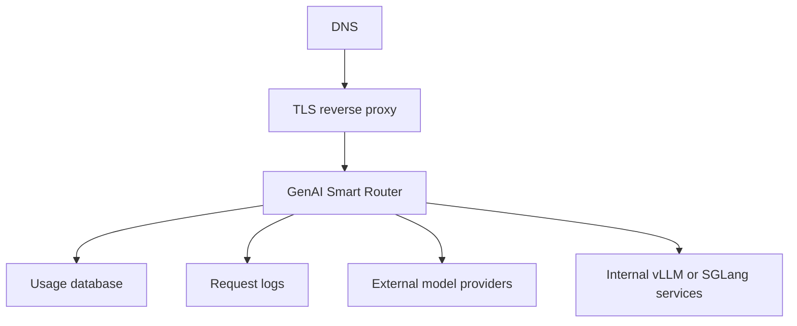

# Deployment

GenAI Smart Router can be deployed as a compiled Linux binary or as a Docker Compose package. Release binaries embed this documentation site, so the router can serve product docs at `/` without a separate web server.

<div class="contactBanner">
  <p>For deployment planning, TLS setup, or managed rollout, contact <a href="mailto:contact@metrum.ai">contact@metrum.ai</a>.</p>
</div>

## Typical Production Shape



## Runtime Inputs

| Input | Purpose |
|---|---|
| Router config | Providers, model groups, caller tokens, limits, cache, usage store |
| Provider key environment | Upstream provider credentials loaded server-side, including internal vLLM/SGLang bearer tokens when required |
| Routing script | Optional TypeScript policy plus packaged helper/dependency files |
| Usage database | Durable reporting and cost-management data |

Enterprise deployments often route to internally hosted vLLM or SGLang services. Configure each service as an OpenAI-compatible provider with a private `/v1` base URL, keep its access token in the deployment environment, and expose only router model groups to callers. Validate each internal upstream directly and through the router before adding it to a production model group.

TypeScript routing scripts are loaded from the deployment filesystem. Package local helper imports and any locked third-party dependencies with the script directory, or deploy a pre-bundled script artifact. The router does not install npm packages at runtime.

External routing-policy calls are controlled by model-group config. For TypeScript policies, enable `script_http` only for groups that need it, list exact allowed service hosts, keep timeout and response-size limits small, and put policy-service auth in env-expanded config headers rather than script files. For standalone policy services, use `strategy: external` with `external_policy.url`, exact `allow_hosts`, low timeouts, response-size limits, and config-owned auth headers.

## Browser And API Behavior

The router serves embedded docs for browser traffic at `/`. Every docs page displays the running binary version and full UTC build timestamp. Docs responses also include `X-Smart-LLMRouter-Version` and `X-Smart-LLMRouter-Build-Date` headers.

Router-owned operational endpoints expose build metadata:

```bash
curl https://llm-api.example.com/version
curl https://llm-api.example.com/readyz
```

API paths keep precedence:

- `/v1/*`
- `/metrics` for caller tokens configured with `metrics_admin: true`
- `/healthz`
- `/readyz`

This makes a hosted router self-documenting without changing OpenAI-compatible client API response bodies.
