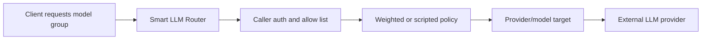

# Metrum Smart LLM Router

Metrum Smart LLM Router is a governed, multi-provider gateway for LLM traffic. Applications and developer tools call one stable endpoint while routing policy, provider credentials, model selection, quotas, caching, and usage telemetry stay server-side.

<div class="contactBanner">
  <p>Interested in deploying Smart LLM Router for your organization? Contact <a href="mailto:contact@metrum.ai">contact@metrum.ai</a>.</p>
</div>

## What It Solves

AI applications often need several model providers. Model quality, latency, price, availability, and API compatibility can shift quickly. Hard-coding provider endpoints and provider keys into every client creates migration cost and weakens governance.

Smart LLM Router gives platform teams one control plane:

- One OpenAI-compatible and Anthropic-compatible gateway.
- Server-side provider key injection.
- Caller tokens with model-group allow lists.
- Weighted, failover, and TypeScript-driven routing.
- In-process response cache for eligible non-tool requests.
- Prometheus metrics, request logs, and durable usage reporting.
- Codex CLI and Claude Code CLI support through the hosted endpoint.

## Model Groups

Callers request stable model groups such as `default`, `fast`, `small`, `medium`, `high`, or `big-coder`. The router then selects an upstream provider/model according to the configured policy.



This lets teams change the provider mix centrally without rewriting Codex, Claude Code, applications, or agents.

## Evaluation Evidence

The hosted docs include a Harbor agentic coding case study that compares Codex CLI and Claude Code CLI across router model groups. It includes the task goal, reward-score definition, models used, tokenomics, cache behavior, latency, throughput, and provider/model usage.

[Read the Harbor case study](/docs/evaluation/harbor-case-study).

## API Surfaces

The router supports the common LLM API surfaces used by modern tools:

| Surface | Typical clients |
|---|---|
| `/v1/chat/completions` | OpenAI-compatible chat clients |
| `/v1/responses` | Codex CLI and Responses-compatible clients |
| `/v1/messages` | Claude Code and Anthropic-compatible clients |
| `/v1/models` | Model discovery filtered by caller token allow list |
| `/v1/usage` | Caller quota/usage lookup |
| `/metrics` | Prometheus-compatible telemetry |

## Hosted Endpoint Example

```bash
export ROUTER_BASE_URL="https://llm-api-engg.metrum.ai"
export ROUTER_TOKEN="rtr_metrum_<user>_<project>_<env>_<key>_<secret>"
export ROUTER_MODEL="big-coder"
```

Router-issued tokens are customer-specific. For deployment access or an evaluation environment, contact [contact@metrum.ai](mailto:contact@metrum.ai).
