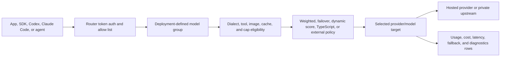

import { DeploymentSpecificNote, RouterCodeBlock } from "@site/src/components/RouterEndpoint";

# Metrum GenAI Smart Router

Metrum GenAI Smart Router is the governed gateway layer for enterprise LLM, VLM, and AI agent traffic. Applications, developer tools, and coding agents call one stable OpenAI-compatible or Anthropic-compatible endpoint while provider credentials, model selection, routing policy, quotas, cache rules, telemetry, and request-time cost accounting stay server-side.

The product is strongest when platform teams need to move quickly across model providers without asking every application or agent user to keep switching endpoints, raw model IDs, or provider keys. A deployment can route ordinary chat, coding-agent tool calls, image/VLM requests, private GPU endpoints, and cost-sensitive production traffic through the same control point.

<DeploymentSpecificNote />

  
Interested in deploying GenAI Smart Router for your organization? Contact <a href="mailto:contact@metrum.ai">contact@metrum.ai</a>.

## Why Teams Deploy It

AI applications rarely standardize on one model forever. Model quality, latency, price, availability, context windows, tool behavior, image support, and account entitlements change over time. Hard-coding provider endpoints and provider keys into every client creates migration cost and weakens governance.

GenAI Smart Router lets platform teams define deployment-owned model groups as quality and cost contracts. Each group has intended workloads, allowed clients, API shapes, modalities, success criteria, quotas, and an upstream provider/model mix that can evolve behind one stable caller-facing name.

| Outcome | What changes |
|---|---|
| Keep clients stable while providers change | Apps, SDKs, Codex CLI, Claude Code, and agent frameworks keep calling one router endpoint and one allowed model group. |
| Lower cost without losing task success | Route simple work to lower-cost targets and reserve stronger targets for requests that need them, using outcome evaluation instead of guesswork. |
| Govern access centrally | Caller tokens enforce model-group allow lists, RPM/TPM limits, concurrency caps, budgets, and metrics-admin separation before any provider call. |
| Route by real request requirements | Tool-bearing, image-bearing, capped, and dialect-specific requests are filtered to targets validated for that shape. |
| Use private and hosted models together | vLLM, SGLang, Baseten-style, OpenRouter-style, and direct provider targets can participate in one deployment policy while private endpoints stay hidden. |
| Make spend and performance explainable | Usage rows and reports preserve selected provider/model, token counts, image fields, cache behavior, latency, attempts, fallbacks, and request-time cost. |

## How It Works

The caller asks for a model group, not a raw provider model. The router checks the caller token, filters targets that cannot satisfy the request shape, selects an eligible target with the configured policy, injects the provider credential server-side, returns the response in the caller's expected API shape, and records usage for governance and triage.

## Product Strengths

- **Multi-dialect gateway:** OpenAI Chat Completions, OpenAI Responses, and Anthropic Messages surfaces for ordinary apps, Codex CLI, Claude Code, and compatible agent frameworks.
- **Model-group contracts:** deployment-defined names encode workload, cost, quality, API shape, modality, and validation expectations.
- **Validated eligibility filtering:** text, image/VLM, tool-call, dialect, and max-token-cap metadata prevent unsafe target selection.
- **Programmable policy:** static, weighted, failover, dynamic-score, TypeScript-scripted, and external-policy routing patterns.
- **Cost governance:** per-key access and budgets plus request-time price/cost storage, including image cost fields and upstream-reported billed cost when available.
- **Operational visibility:** request logs, relational usage data, diagnostics child tables, report examples, downstream and upstream latency/throughput views, and Prometheus telemetry restricted to metrics-admin tokens.
- **Private upstream control:** internally hosted OpenAI-compatible inference services can sit behind the same caller API as external providers.
- **Outcome validation:** Harbor or any workload-appropriate verifier can compare success, cost, token volume, latency, fallbacks, and provider mix before promotion.

## Model Groups

Callers request stable model groups defined by the deployment. Names such as `default`, `fast`, `small`, `medium`, `high`, `big-coder`, or `vision` appear in some examples because they are used by one reference or hosted deployment; GenAI Smart Router does not require those names.

Not every task needs the most expensive model. A well-designed deployment uses objective evaluation to keep each model group successful for its intended workload while routing simpler work to lower-cost targets and reserving stronger targets for requests that need them.

See [Concepts And Glossary](/docs/concepts) for the terms used throughout these docs, and [Model Group Quality Criteria](/docs/evaluation/model-group-quality) for the contract fields to define before rollout.

## Evaluate The Product

For a first evaluation, run one path through the gateway and inspect both the caller result and the operator evidence:

1. Call [`/v1/models`](/docs/getting-started/available-models) with the router token to discover allowed groups.
2. Run an OpenAI-compatible chat request from the [Hosted Quickstart](/docs/getting-started/hosted-quickstart).
3. Run the relevant agent workflow: [Codex CLI](/docs/getting-started/codex-cli), [Claude Code CLI](/docs/getting-started/claude-code-cli), or an OpenAI-compatible SDK.
4. Exercise one request-shape control: tool call, image input, quota, or a deployment-specific model group.
5. Review usage, latency, selected provider/model, fallback behavior, and cost using [Report Examples](/docs/operations/report-examples).

[Evaluate GenAI Smart Router](/docs/evaluation/evaluate-smart-router) gives a complete checklist and proof points to request.

## Proof Points

The docs include an outcome-based Harbor coding-agent case study that compares Codex CLI and Claude Code CLI across router model groups. It records the task goal, verifier reward score, models used, tokenomics, cache behavior, latency, throughput, fallback behavior, and provider/model usage. The same pattern can be applied to extraction accuracy checks, OCR targets, unit tests, browser-control tasks, golden datasets, or product acceptance tests.

- [Read the Harbor case study](/docs/evaluation/harbor-case-study)
- [Review product capabilities](/docs/evaluation/product-capabilities)
- [Review cost governance](/docs/evaluation/cost-governance)
- [Review security and trust posture](/docs/evaluation/security-and-trust)
- [Compare gateway fit](/docs/evaluation/competitive-landscape)

## Where To Go Next

| Role | Start here |
|---|---|
| Buyer or evaluator | [Evaluate GenAI Smart Router](/docs/evaluation/evaluate-smart-router), [Solution Brief](/docs/solution-brief), [Security And Trust](/docs/evaluation/security-and-trust) |
| Application developer | [Hosted Quickstart](/docs/getting-started/hosted-quickstart), [API Compatibility](/docs/reference/api-compatibility), [Available Models And Access](/docs/getting-started/available-models) |
| Coding-agent user | [Codex CLI](/docs/getting-started/codex-cli), [Claude Code CLI](/docs/getting-started/claude-code-cli), [Image Analysis And VLM Routing](/docs/configuration/image-analysis-vlm) |
| Platform administrator | [Router Configuration](/docs/configuration/router-config), [Key Generation](/docs/operations/key-generation), [Usage Reporting](/docs/operations/usage-reporting), [Deployment Readiness](/docs/evaluation/deployment-readiness) |

## API Surfaces

The router supports the common LLM API surfaces used by modern tools:

| Surface | Typical clients |
|---|---|
| `/v1/chat/completions` | OpenAI-compatible chat clients |
| `/v1/responses` | Codex CLI and Responses-compatible clients |
| `/v1/messages` | Claude Code and Anthropic-compatible clients |
| [`/v1/models`](/docs/getting-started/available-models) | Model discovery filtered by caller token allow list |
| `/v1/usage` | Caller quota/usage lookup |
| `/metrics` | Prometheus telemetry for `metrics_admin` caller tokens |

## Endpoint Example

<RouterCodeBlock>
{`
export ROUTER_BASE_URL="{{origin}}"
export ROUTER_TOKEN="rtr_metrum_<user>_<project>_<env>_<key>_<secret>"
export ROUTER_MODEL="<allowed-model-group>"
`}
</RouterCodeBlock>

Router-issued tokens are customer-specific. For deployment access or an evaluation environment, contact [contact@metrum.ai](mailto:contact@metrum.ai).
