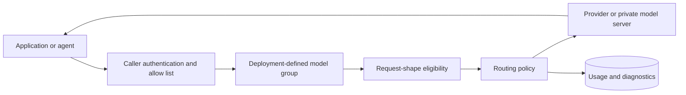

# GenAI Smart Router

GenAI Smart Router is a self-managed gateway for OpenAI Chat, OpenAI Responses,
Anthropic Messages, VLM, and tool-capable agent traffic. Applications call one
stable endpoint while deployment operators control provider credentials,
model-group access, request-shape eligibility, quotas, routing policy, and
usage accounting.

## Why Use It

- Keep provider credentials server-side and give callers revocable scoped
  router tokens.
- Change validated provider/model mixes behind deployment-defined model groups
  without rewriting every client.
- Filter tool, image, dialect, context, and output-cap requests to targets
  validated for those shapes.
- Enforce RPM, TPM, concurrency, and token/cost budgets before upstream calls.
- Preserve sanitized request IDs, attempts, latency, token, fallback, and
  request-time cost evidence for operations.
- Combine external providers with private OpenAI-compatible upstreams.

## Request Flow

The router does not guarantee model quality or provider availability. Operators
must validate each active provider/model/API combination and retain a rollback
path. See [Architecture, Platforms, And
Limitations](/docs/reference/architecture-limitations).

## Start Here

1. Choose [Docker Compose, binary, or Kubernetes](/docs/installation/).
2. Create deployment-owned configuration and protected provider credentials.
3. Generate the self-managed runtime-policy license and caller token.
4. Discover the caller's allowed groups through
   [`/v1/models`](/docs/getting-started/available-models).
5. Run the [quickstart](/docs/getting-started/hosted-quickstart) and the exact
   Chat, Responses, Messages, tool, image, or streaming shapes your clients use.
6. Review [security boundaries](/docs/security-governance/overview),
   [observability](/docs/operations/observability), and the [upgrade
   guide](/docs/release-notes/upgrade-guide) before production traffic.

Questions and bugs use the repository's public issue forms. Suspected
vulnerabilities must use GitHub private vulnerability reporting; do not place
secrets or customer content in public issues.

