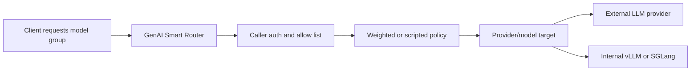

import { DeploymentSpecificNote, RouterCodeBlock } from "@site/src/components/RouterEndpoint";

# Metrum GenAI Smart Router

Metrum GenAI Smart Router is a governed, multi-provider gateway for LLM, VLM, and AI agent traffic. Applications, developer tools, and coding agents call one stable endpoint while routing policy, provider credentials, model selection, quotas, caching, and usage telemetry stay server-side. It can run inside an enterprise network, in a customer cloud account, or as a Metrum-managed instance.

<DeploymentSpecificNote />

  
Interested in deploying GenAI Smart Router for your organization? Contact <a href="mailto:contact@metrum.ai">contact@metrum.ai</a>.

## What It Solves

AI applications often need several model providers. Model quality, latency, price, availability, and API compatibility can shift quickly. Hard-coding provider endpoints and provider keys into every client creates migration cost and weakens governance. GenAI Smart Router lets platform teams define model groups as quality and cost contracts instead: each group has intended workloads, success criteria, allowed clients, and a provider/model mix that can evolve behind one stable API.

GenAI Smart Router gives platform teams one governed control point:

- One OpenAI-compatible and Anthropic-compatible gateway.
- Server-side provider key injection.
- Caller tokens with model-group allow lists.
- Weighted, failover, and TypeScript-driven routing.
- Capability-aware routing for text, image/VLM, and tool-call requests.
- Enterprise routing to internally hosted vLLM or SGLang services.
- In-process response cache for eligible non-tool requests.
- Metrics-admin Prometheus telemetry, request logs, and durable usage reporting with request-time cost fields.
- Outcome-oriented evaluation loops that compare task success, latency, token volume, fallback behavior, and cost across model groups.
- Codex CLI and Claude Code CLI support through the deployment endpoint.

## Model Groups

Callers request stable model groups defined by the deployment. Names such as `default`, `fast`, `small`, `medium`, `high`, `big-coder`, or `vision` may appear in examples because they are used by one reference or hosted deployment; GenAI Smart Router does not require those names. The router selects an upstream provider/model according to the configured policy for whichever group the caller token is allowed to use.

Not every task needs the most expensive model. A well-designed deployment uses objective evaluation to keep each model group successful for its intended workload while routing simple work to lower-cost targets and reserving stronger targets for requests that need them.

This lets teams change the provider mix centrally without rewriting Codex, Claude Code, applications, or agents.

## Evaluation Evidence

The hosted docs include a Harbor agentic coding case study that compares Codex CLI and Claude Code CLI across router model groups. It includes the task goal, reward-score definition, models used, tokenomics, cache behavior, latency, throughput, and provider/model usage. This is the model-group optimization loop: keep outcome quality positive while finding the lowest-cost provider/model mix that works for the workload.

[Read the Harbor case study](/docs/evaluation/harbor-case-study).

[Define model-group quality criteria](/docs/evaluation/model-group-quality).

[Review deployment evaluation](/docs/evaluation/deployment-evaluation).

[See self-hosted vLLM and SGLang upstream examples](/docs/configuration/self-hosted-upstreams).

[Review product capabilities](/docs/evaluation/product-capabilities).

[Compare GenAI Smart Router with other GenAI gateways](/docs/evaluation/competitive-landscape).

## API Surfaces

The router supports the common LLM API surfaces used by modern tools:

| Surface | Typical clients |
|---|---|
| `/v1/chat/completions` | OpenAI-compatible chat clients |
| `/v1/responses` | Codex CLI and Responses-compatible clients |
| `/v1/messages` | Claude Code and Anthropic-compatible clients |
| `/v1/models` | Model discovery filtered by caller token allow list |
| `/v1/usage` | Caller quota/usage lookup |
| `/metrics` | Prometheus telemetry for `metrics_admin` caller tokens |

## Endpoint Example

<RouterCodeBlock>
{`
export ROUTER_BASE_URL="{{origin}}"
export ROUTER_TOKEN="rtr_metrum_<user>_<project>_<env>_<key>_<secret>"
export ROUTER_MODEL="<allowed-model-group>"
`}
</RouterCodeBlock>

Router-issued tokens are customer-specific. For deployment access or an evaluation environment, contact [contact@metrum.ai](mailto:contact@metrum.ai).
