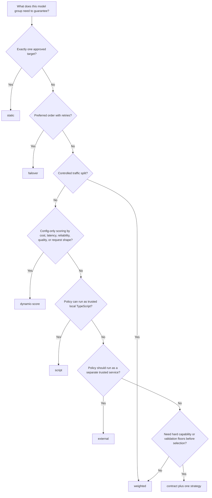

# Routing Strategy Decision Tree

Use this page as the single starting point for choosing a model-group routing strategy. A caller still requests one allowed model group from `/v1/models`; the strategy only chooses among eligible targets inside that group.

## Strategy Matrix

| Strategy | Use when | Do not use when | Operator skill | Misconfiguration blast radius | Observability cost | Rollback story |
|---|---|---|---|---|---|---|
| `static` | One reviewed target must serve the group, such as a smoke group, regulated workflow, or known-good rollback group. | The group needs provider diversity, cost optimization, or automatic failover. | Low. | Concentrated on one provider/model; failures affect the whole group. | Low; inspect selected target, status, latency, and errors. | Point the static target back to the previous provider/model or switch callers to a known-good group. |
| `failover` | Target order is the policy and later targets are reliability backups. | Targets are interchangeable and should receive a normal traffic mix. | Low to medium. | Timeout and retry settings can multiply latency or cost. | Medium; inspect attempts, retry class, and fallback usage. | Restore the previous order or remove the failing primary target. |
| `weighted` | All active targets passed the same workload gate and traffic should be split for rollout, cost mix, or provider diversity. | One target is much lower quality or lacks required capabilities for common request shapes. | Medium. | Bad weights can shift too much production traffic quickly. | Medium; inspect provider/model mix, cost, latency, error rate, and fallback. | Set unsafe target weights to zero or restore the previous weights. |
| `dynamic_score` | Operators want config-only scoring from request shape, cost, observed performance, reliability, and validation metadata. | The policy needs arbitrary business logic, network calls, or opaque ML scoring. | Medium to high. | Overly strict thresholds or bad score terms can remove good targets or overfit short windows. | High; inspect score terms, thresholds, cold-start mode, observations, and decision telemetry. | Disable only pinning with `affinity.enabled: false`, or switch to weighted and restore the previous policy block. |
| `script` | A trusted deployment wants local TypeScript policy packaged with config and reviewed with release artifacts. | The policy needs independent deployment, service logs, or network dependencies not approved for router runtime. | High. | Script bugs can misroute or fail closed for the whole group. | High; inspect script labels, selected target, fallback list, and script errors. | Restore the previous script artifact or switch the group to weighted/failover. |
| `external` | A trusted policy service owns routing logic, auditing, model scoring, or enterprise policy integration. | The service cannot meet strict auth, allow-list, timeout, and fail-closed requirements. | High. | Service outage or bad responses can block the group or choose unsafe targets. | High; inspect policy request status, latency, response class, and target decision telemetry. | Set `mode: baseline` to skip calls, use `shadow` for non-serving evaluation, or restore the previous service/local strategy. |
| `intelligent` | A licensed deployment needs to validate the reserved decision-model configuration contract while continuing to serve the deterministic baseline target. | The deployment expects a decision model to select, shadow, or enforce a serving target in the current release. | High. | Misreading the baseline-only contract can create false promotion evidence. | Low; current behavior records bounded baseline-only policy telemetry and makes no decision-model call. | Switch to a shipped selector such as weighted, dynamic score, script, or external. |
| `contract` | The group promises capability, validation freshness, quality floors, modalities, tools, or API shapes before selection. | The deployment cannot maintain validation metadata and promotion evidence. | Medium to high. | Stale validation or overly strict floors can make every target ineligible. | Medium to high; inspect contract requirement buckets and validation metadata. | Relax the contract, refresh validation, or restore the previous contract plus strategy. |

## Selection Notes

- Use `static` for the smallest possible blast radius during a first smoke or emergency rollback.
- Use `failover` when priority order matters more than traffic distribution.
- Use `weighted` when every target can safely serve the workload and the deployment wants gradual rollout control.
- Use `dynamic_score` when the policy can be expressed with safe scalar signals and should remain inside config.
- Use `script` when a compact trusted local policy is easier to review than a large config block.
- Use `external` only for trusted deployment infrastructure. The service receives request context and eligible target metadata, so protect it like routing control plane infrastructure.
- Use `contract` with another strategy when the model group itself is a quality and capability promise. Contract is a gate before selection, not a peer selector that replaces the strategies above.
- Treat `intelligent` as a baseline-only licensed configuration foundation in
  the current release. It validates a bounded decision-model contract but does
  not call that model, produce a recommendation, or alter target selection.
  Use external-policy `shadow` and `enforce` modes when a deployment needs a
  shipped adaptive promotion path.
- Do not use the legacy `latency`, `cost`, or `semantic` strategy names for new groups. They remain for older configs only and are not mature adaptive routers: they rank configured integers or stub keyword classes rather than live observations or embeddings. Prefer `dynamic_score` for built-in adaptive scoring and `script`/`external` for custom decision logic.

## Detailed References

- [Customer-Controlled Routing](./customer-controlled-routing)
- [Router Configuration](../configuration/router-config)
- [Dynamic Score Routing](../configuration/dynamic-score-routing)
- [TypeScript Routing Policy](../configuration/routing-typescript)
- [External Routing Policy Service](../configuration/external-routing-policy)
- [Model Group Contracts](../configuration/model-group-contracts)
- [Model Group Quality Criteria](../evaluation/model-group-quality)
