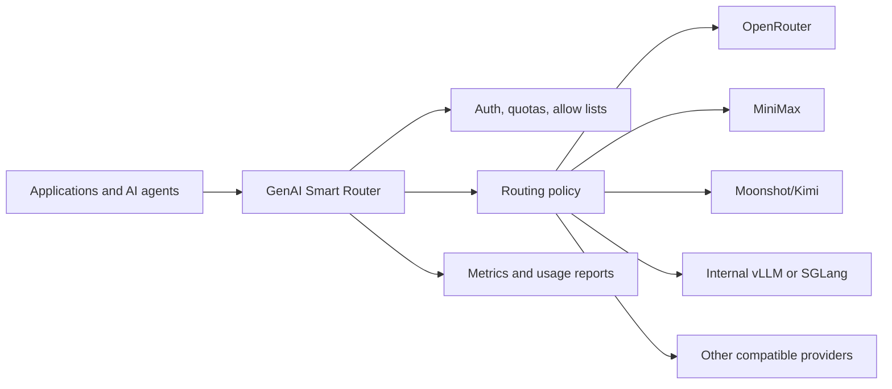
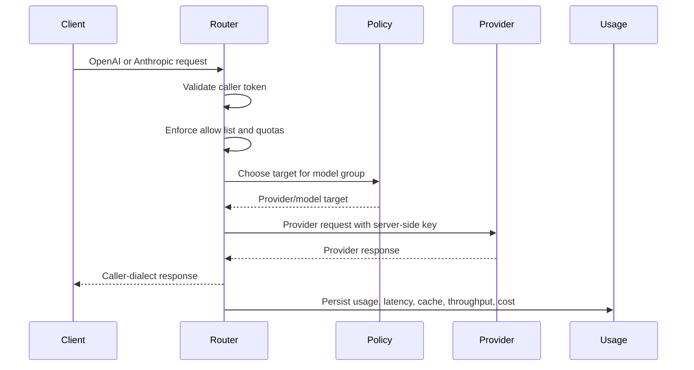

# GenAI Smart Router Solution Brief

Metrum GenAI Smart Router is a provider-neutral gateway for enterprises that need flexibility across LLMs, VLMs, tool-capable models, and AI agent clients without losing security, cost control, or operational visibility.

<div class="contactBanner">
  <p>Interested in deploying GenAI Smart Router? Contact <a href="mailto:contact@metrum.ai">contact@metrum.ai</a>.</p>
</div>

## Executive Summary

Modern AI teams rarely standardize on one model forever. Different models fit coding, extraction, summarization, planning, vision, browser-control context, and latency-sensitive chat. Provider availability, rate limits, price, and entitlements also change over time.

GenAI Smart Router centralizes that complexity. Clients speak OpenAI-compatible or Anthropic-compatible APIs. The router authenticates the caller, checks model-group authorization, selects an upstream target that satisfies the request's text, image, and tool requirements, injects the provider credential, normalizes the response, records usage, and returns the response in the caller's expected dialect.

The operational model is outcome-oriented: define what each model group must accomplish, validate that outcome with Harbor or another objective harness, and then tune the provider/model mix for cost, latency, and reliability. A simple extraction task, a routine coding edit, a screenshot/OCR task, and a complex agentic refactor do not need the same model economics.

When buyers ask how to know whether a routed group works for their workload, the answer is an evidence-first comparison against a fixed model or previous policy. See [Prove Router Quality](/docs/evaluation/prove-router-quality) for the public evaluation playbook.



## Enterprise Value

- **Provider optionality:** adopt new model providers centrally while applications keep stable model-group names.
- **Multimodal readiness:** support text, image/VLM, OCR-style, browser-control, and tool-call requests through the same governed endpoint.
- **Enterprise model control:** include internally hosted vLLM or SGLang services in the same routing policy as external providers.
- **Cost control:** steer routine traffic to lower-cost routes, reserve heavier routes for approved keys, and report request-time cost by user, project, provider, model, and IP.
- **Security:** keep provider keys server-side and issue revocable router tokens to callers.
- **Reliability:** use weighted routing, fallback, and scripted policies to reduce provider-specific blast radius.
- **Developer productivity:** support Codex CLI, Claude Code CLI, OpenAI-compatible clients, and Anthropic-compatible clients through one endpoint.
- **Outcome-oriented optimization:** use agentic validation harnesses such as Harbor to tune model groups for successful task outcomes, latency, throughput, and cost.
- **Operational visibility:** expose metrics-admin telemetry, request logs, cache behavior, latency, token throughput, and visible build version metadata.

## Model Group Quality Contracts

Each deployment should define success criteria for every exposed model group. The criteria should match the group's purpose, not a generic "best model" label.

| Group Purpose | Example Quality Contract |
|---|---|
| Low-cost general work | completes short chat, extraction, summarization, and simple edit tasks inside a cost and latency target |
| Balanced development | passes routine coding tests, supports required tool dialects, and handles occasional image context through VLM-capable targets |
| Coding agents | passes Harbor or similar agentic tasks with file/tool assertions, acceptable fallback rate, and measured cost savings |
| VLM workloads | reads images or screenshots accurately enough for the target task and records image token/cost fields |
| Private upstreams | keeps model endpoints private while meeting direct upstream and router-level smoke criteria |

This lets platform teams reserve expensive targets for workloads that need them while using lower-cost routes for work that still meets its objective.

## Cost Governance

Agentic AI can turn one user request into many model calls, tool calls, retries, and follow-up requests. Token cost management becomes a platform concern rather than a per-application detail.

GenAI Smart Router addresses the controllable layer:

- Enforce caller allow lists and budgets before provider calls.
- Route workloads by cost, quality, latency, and tool compatibility.
- Cache eligible deterministic responses.
- Compare provider/model usage and stored request-time cost using durable reports.
- Track usage by caller key, project, environment, model group, provider, model, hour, IP, and USD cost.
- Evaluate model groups with agentic harnesses so cost savings are measured against task outcomes, not only token price.

The Harbor case study in these docs shows the same principle numerically: successful agentic coding runs can differ substantially in token volume, latency, fallback use, and output throughput even when final reward score is identical. Those tokenomics are the operational signal that turns model routing from guesswork into policy.

## Routing And Governance



## Example Deployment Outcome

A customer can expose one endpoint to internal developers:

```bash
https://llm-api.example.com/v1
```

Developers use stable model groups defined by their deployment. Platform owners can change the underlying provider mix without client rewrites. Names such as `default`, `fast`, `small`, `medium`, `high`, `big-coder`, and `vision` are examples used by one reference or hosted deployment, not product-required names.

## Commercial Paths

Metrum supports several buyer paths:

- Evaluation or pilot access for teams validating workloads, reporting, security posture, and provider fit.
- Enterprise self-hosted deployment for customers that need the router, usage database, provider access, and signed JSON license enforcement inside their own infrastructure.
- Private managed deployment for customers that want a dedicated customer deployment operated for them.
- Renewal, replacement, and prepaid volume top-up for existing licensed deployments.
- Marketplace or private-offer procurement where available.

The evaluation-to-purchase flow is request evaluation, receive endpoint/token or deployment package, validate workloads, inspect savings/performance/security evidence, then convert to an enterprise self-hosted, private managed, marketplace/private-offer, renewal, or volume-prepurchase path. A Stripe-enabled licensing portal for approved evaluation, pilot, renewal, or top-up packages is planned but not shipped until the portal and fulfillment work is implemented. See [Choose a Deployment Path](/docs/licensing/deployment-paths) and [Commercial Evaluation Path](/docs/evaluation/commercial-evaluation).

## Deployment Planning Checklist

- Which clients need OpenAI, Responses, or Anthropic compatibility?
- Which model groups should be exposed, and what success criteria should each group satisfy?
- Which provider models are approved and validated?
- What token, quota, and budget rules are required?
- Which reports and dashboards are needed for cost governance, security access review, chargeback, and support triage?
- Which workloads are cache-eligible?
- What deployment and TLS model is preferred?
- Is the deployment hosted, private-cloud, or enterprise/on-prem with signed license enforcement?

For a fuller rollout workflow, see [Deployment Readiness](/docs/evaluation/deployment-readiness), [Prove Router Quality](/docs/evaluation/prove-router-quality), [Model Group Quality Criteria](/docs/evaluation/model-group-quality), [Product Capabilities](/docs/evaluation/product-capabilities), [Cost Governance](/docs/evaluation/cost-governance), and [Competitive Landscape](/docs/evaluation/competitive-landscape).

For a deployment discussion, email [contact@metrum.ai](mailto:contact@metrum.ai).
