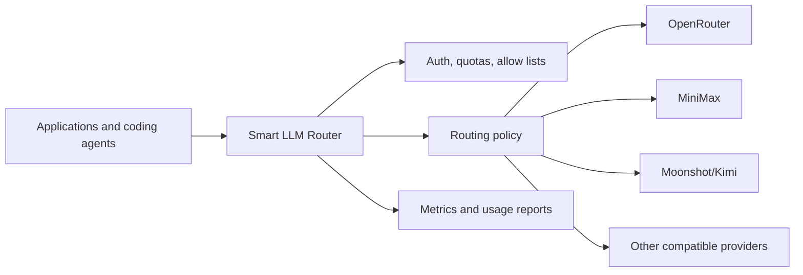
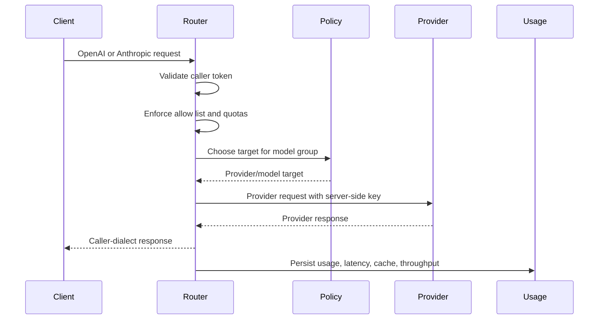

# Smart LLM Router Solution Brief

Metrum Smart LLM Router is a provider-neutral LLM gateway for enterprises that need flexibility across model providers without losing security, cost control, or operational visibility.

<div class="contactBanner">
  <p>Interested in deploying Smart LLM Router? Contact <a href="mailto:contact@metrum.ai">contact@metrum.ai</a>.</p>
</div>

## Executive Summary

Modern AI teams rarely standardize on one model forever. Different models fit coding, extraction, summarization, planning, and latency-sensitive chat. Provider availability, rate limits, price, and entitlements also change over time.

Smart LLM Router centralizes that complexity. Clients speak OpenAI-compatible or Anthropic-compatible APIs. The router authenticates the caller, checks model-group authorization, selects an upstream target, injects the provider credential, normalizes the response, records usage, and returns the response in the caller's expected dialect.



## Buyer Value

- **Provider optionality:** adopt new model providers centrally while applications keep stable model-group names.
- **Cost control:** steer routine traffic to lower-cost routes, reserve heavier routes for approved keys, and report usage by user, project, provider, model, and IP.
- **Security:** keep provider keys server-side and issue revocable router tokens to callers.
- **Reliability:** use weighted routing, fallback, and scripted policies to reduce provider-specific blast radius.
- **Developer productivity:** support Codex CLI, Claude Code CLI, OpenAI-compatible clients, and Anthropic-compatible clients through one endpoint.
- **Operational visibility:** expose metrics, request logs, cache behavior, latency, and token throughput.

## Cost Governance

Agentic AI can turn one user request into many model calls, tool calls, retries, and follow-up requests. Token cost management becomes a platform concern rather than a per-application detail.

Smart LLM Router addresses the controllable layer:

- Enforce caller allow lists and budgets before provider calls.
- Route workloads by cost, quality, latency, and tool compatibility.
- Cache eligible deterministic responses.
- Compare provider/model usage using durable reports.
- Track usage by caller key, project, environment, model group, provider, model, hour, and IP.

## Routing And Governance



## Example Deployment Outcome

A customer can expose one endpoint to internal developers:

```bash
https://llm-api.example.com/v1
```

Developers use stable model groups such as `default`, `fast`, `small`, `medium`, `high`, and `big-coder`. Platform owners can change the underlying provider mix without client rewrites.

## Evaluation Checklist

- Which clients need OpenAI, Responses, or Anthropic compatibility?
- Which model groups should be exposed?
- Which provider models are approved and validated?
- What token, quota, and budget rules are required?
- Which reports and dashboards are needed for cost governance?
- Which workloads are cache-eligible?
- What deployment and TLS model is preferred?

For a deployment discussion, email [contact@metrum.ai](mailto:contact@metrum.ai).
