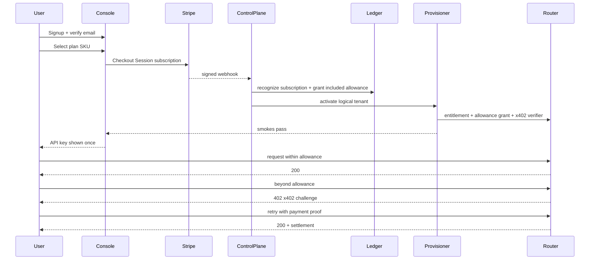

# Master E2E: Cloud subscription → provision → use → overage → expiry

**Commercial model:** base monthly Stripe subscription + model-mix included allowance (input+output tokens) + x402 overage. Stripe never on the router inference hot path.

**Mocks:** [previews/checkout-provisioning.html](previews/checkout-provisioning.html) · [previews/prosumer-console.html](previews/prosumer-console.html) · [issues/506-x402-overage.html](issues/506-x402-overage.html)

---

## Screen catalog (IDs)

| ID | Screen | Persona |
| --- | --- | --- |
| S0 | Marketing / pricing | P1 |
| S1 | Signup | P1 |
| S2 | Verify email | P1 |
| S3 | Create organization | P2 |
| S4 | Plan picker | P2 |
| S5 | Stripe Checkout (hosted) | P2 |
| S6 | Confirming payment (console) | P2 |
| S7 | Provisioning status | P2 |
| S8 | Ready — key reveal (once) | P2/P3 |
| S9 | Console home | P2/P3 |
| S10 | First request tutorial | P3 |
| S11 | Allowance exhausted / payment-required guidance | P3 |
| S12 | x402 client pay + retry | P3 |
| S13 | Stripe Customer Portal | P2 |
| S14 | Cancel / past-due / expired | P2 |
| S15 | Support case (safe IDs) | P6 |

---

## Step-by-step

### 1. Pricing (S0)

| | |
| --- | --- |
| **User sees** | Plan tiles: name, base monthly fee, included input/output tokens by model mix, x402 overage note, region list, CTA Subscribe |
| **User does** | Clicks Subscribe on `plan_starter_mix_v3` |
| **System does** | Deep-link to signup with `plan_sku` query |
| **Knows** | Public pricing page |
| **Validated** | Docs QA; no live prices without Finance (#540) |

**Exact fields (fictional):** Plan `Starter Mix` · `$49/mo` · Included `50M in / 10M out` · Groups `default, fast, high` · Overage `x402 bands per group`

### 2. Signup + verify (S1–S2)

| | |
| --- | --- |
| **User sees** | Email, password or OIDC button, terms checkbox (version `tos_2026_07`), Verify pending banner |
| **User does** | Signs up with `alex@example.invalid`, accepts terms, clicks verification link |
| **System does** | Control plane: user `usr_…`, state `pending_email` → `pending_funding`; audit event; email via SES |
| **Knows** | Verification email; console banner |
| **Validated** | Cannot create Checkout until verified |

### 3. Organization (S3)

| | |
| --- | --- |
| **User sees** | Org name, region select (immutable after provision), role Owner |
| **User does** | Org `Acme Demo`, region `us-east-1` |
| **System does** | `org_…`, `tenant_…` `pending_funding`; region locked |

### 4. Plan picker (S4)

| | |
| --- | --- |
| **User sees** | Catalog version `plan_catalog_v12`, SKUs from #540, included units, feature flags |
| **User does** | Confirms `price_starter_mix_monthly`, Continue to Stripe |
| **System does** | Server creates Checkout Session with idempotency key; browser cannot submit arbitrary Price ID |

### 5. Stripe Checkout (S5)

| | |
| --- | --- |
| **User sees** | Stripe-hosted page (card fields — never Metrum DOM) |
| **User does** | Completes subscription payment (test mode) |
| **System does** | Stripe events; Metrum webhook verifies signature; receipt row; fulfillment outbox |
| **Knows** | Return URL shows **Confirming payment** until webhook fulfillment true (redirect alone never activates) |

### 6. Subscription manager / control plane (after webhook)

What the **subscription manager** (control plane worker) does — not user-visible as a form:

1. Map Stripe subscription → entitlement (`active` / `trialing`).
2. Post ledger: subscription recognition (#523).
3. Issue **included-allowance grant** for period (`in_tok`, `out_tok` budgets, `plan_catalog_v12`, expiry = period end).
4. Enqueue provisioning saga (#526).
5. Email: “Subscription active — provisioning endpoint”.

### 7. Provisioning (S7) — what / where / how

**Shared Prosumer (launch default D1):**

| Resource | Where | How |
| --- | --- | --- |
| Logical tenant + caller | Control-plane Postgres | Config activation / draft set |
| Entitlement + allowance grant | Signed artifacts → router trust store | Grant issuer KMS |
| x402 verifier public config | Router config / secret refs | Facilitator allowlist, payee refs |
| Quotas / model allowlist | Tenant-scoped router config | From plan catalog |
| API hostname | Shared regional `https://api.example.invalid` | No per-tenant DNS |
| Provider keys | Fleet Secrets Manager | Pooled; never shown to customer |

**Dedicated tier (paid):** additionally namespace/Helm, NetworkPolicy, secret refs, license file, ingress DNS/TLS.

**Health gate before token:** `/version`, `/readyz`, authenticated `/v1/models`, Chat + Responses + Messages smoke, grant reservation smoke, metrics-admin still 403 for normal caller.

**User knows:** S7 timeline tiles flip to complete; email “Endpoint ready”.

### 8. Key reveal (S8)

| | |
| --- | --- |
| **User sees** | Endpoint, key `msk_live_…` **once**, copy buttons, curl samples, dismiss “I stored the key” |
| **System does** | Store hash + public ID only; raw never logged |
| **Validated** | Playwright: key absent from DOM after dismiss; not in network analytics |

### 9. First requests within allowance (S9–S10)

Admission (#522): entitlement active → reserve worst-case from included allowance → upstream → settle actual → release remainder. **No x402.**

Console: allowance remaining bars (input/output), request IDs, cost estimate vs product charge.

### 10. Overage via x402 (S11–S12)

When remaining allowance < quote:

1. Router returns **HTTP 402** + x402 `PAYMENT-REQUIRED` + error `payment-required` (D11).
2. Compatible client pays; retries identical request with payment header.
3. Router verifies + settles **once**, then upstream; settlement → ledger (#523).
4. Console shows x402 spend tile + settlement ID (safe scalars).

### 11. After period end / cancel / past-due (S13–S14)

| Event | Subscription manager | Router | User sees |
| --- | --- | --- | --- |
| Renewal success | New period grant; revoke expired grant | Accepts new grant | Allowance resets |
| Payment failed | `past_due`; grace per finance | After grace: `entitlement-past-due` before upstream | Banner + Portal link |
| Customer cancels | Revoke future grants/keys; retain financial evidence; teardown after retention | Immediate deny new traffic | Cancelled state + data export window |
| Allowance expires at period end without renew | No new grant | Deny / payment-required only if policy allows unpaid overage — default: entitlement required first | Subscribe / Portal |

**Teardown order:** block grants → wait in-flight/outbox → snapshot evidence → delete ephemeral compute/DNS/secrets only after legal/finance approval. Ledger never deleted as rollback shortcut.

### 12. How validated (release / #534)

| Gate | Proof |
| --- | --- |
| Signup→Checkout→webhook | Stripe test-mode; duplicate webhook idempotent |
| Provision | Staging saga; `/readyz` + three API shapes |
| Allowance path | Concurrent reserve never exceeds grant |
| x402 path | Challenge → pay → one upstream; facilitator outage → `payment-unavailable` |
| Cancel | Key revoked; no Stripe in router traces |
| Security | No secrets in logs; `/metrics` 403 for ordinary caller |

---

## Alternate paths (must be in mocks)

- Browser return before webhook → S6 stays Confirming; no key
- Provision step fails → no key; retry from durable op ID; support sees safe operation ID
- Risk policy blocks trial (#529) → verify identity / paid-only
- Region unsupported (D6) → refuse signup
- x402 proof replay/expired → fresh challenge `payment-invalid`
