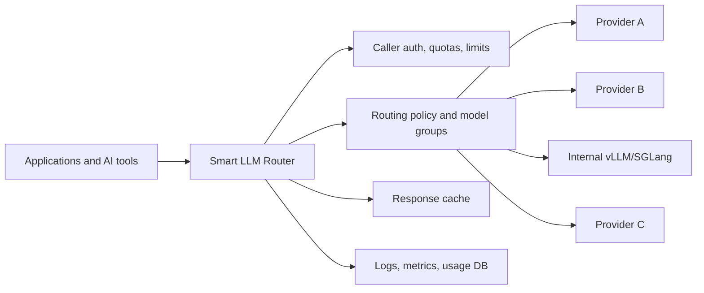
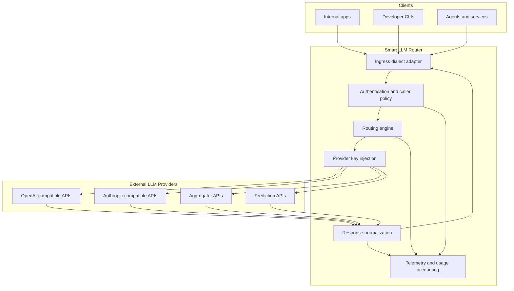
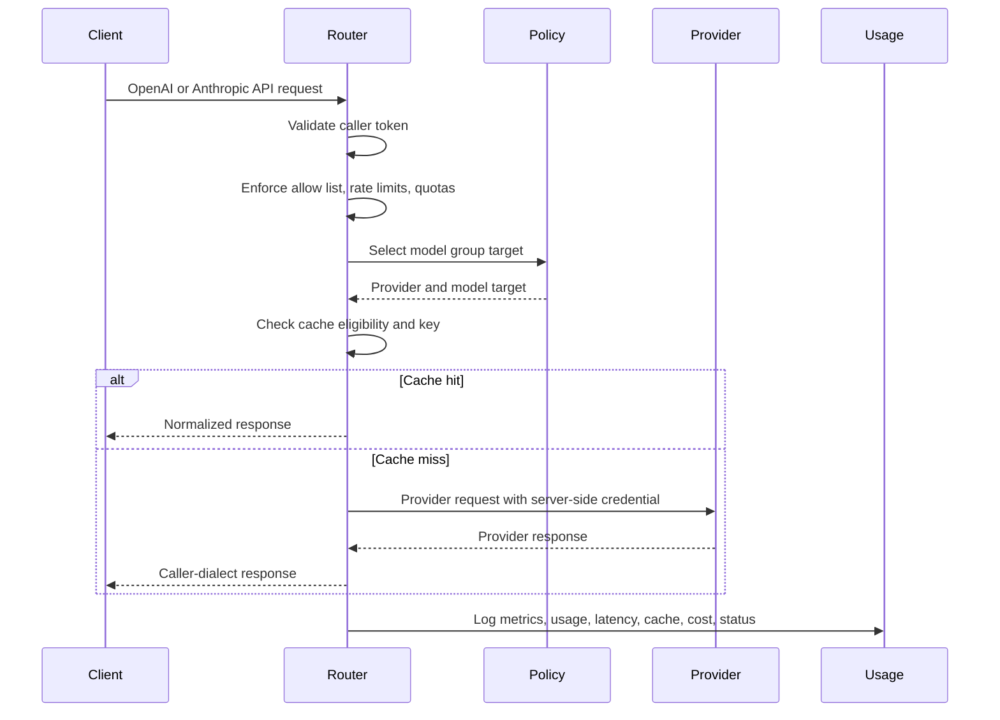
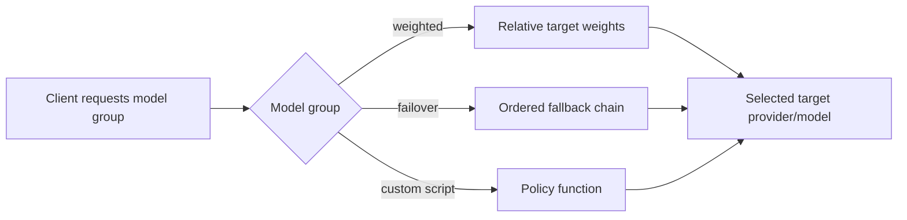
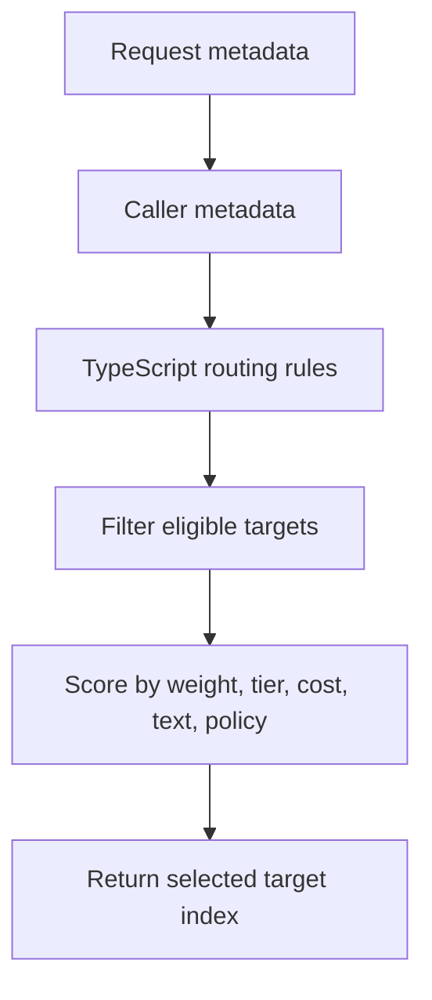
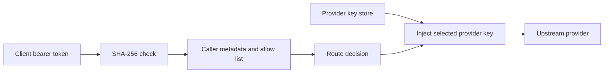
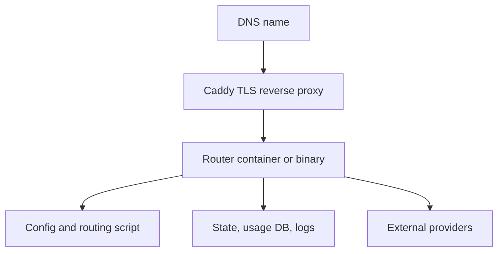

# Smart LLM Router Solution Brief

Smart LLM Router is a provider-neutral gateway for enterprise LLM traffic. It lets teams expose one controlled API endpoint to applications and developer tools while routing requests across multiple upstream model providers using policy, cost, availability, latency, caller identity, and workload-specific rules.

The result is a simpler operating model: applications integrate once, operators keep provider keys and routing policy server-side, and platform teams get consistent authentication, quotas, cache behavior, audit logs, metrics, and usage reports across heterogeneous LLM backends.

## Executive Summary

Modern AI teams often need more than one model provider. Different models may be better for coding, summarization, data extraction, low-latency chat, or high-reasoning workflows. Provider availability, pricing, rate limits, and access permissions also change over time. Hard-coding provider-specific endpoints into each application creates operational risk and makes migration expensive.

Smart LLM Router centralizes that complexity behind one internal API surface. Clients can speak OpenAI-style or Anthropic-style APIs; the router authenticates the caller, selects an allowed model group, chooses an upstream target, injects the provider credential, normalizes responses, records usage, and returns the response in the caller's expected dialect.



## Buyer Value

Smart LLM Router is useful when an organization wants the flexibility of multiple LLM providers without distributing provider credentials, rewriting every client, or losing cost and usage visibility.

Technical buyers typically evaluate it for:

- **Provider optionality:** adopt new models or aggregators centrally while applications keep using stable internal model names.
- **Enterprise model control:** route to internally hosted vLLM or SGLang services through OpenAI-compatible upstream APIs while callers keep using router model groups.
- **Cost control:** steer routine traffic to lower-cost targets, reserve premium models for approved keys or workloads, and report usage by person, project, provider, and model.
- **Security:** keep upstream provider keys server-side, authenticate callers with revocable router tokens, and restrict each token to approved model groups.
- **Reliability:** use weighted routing, ordered fallback, and provider abstraction to reduce blast radius from model outages or entitlement changes.
- **Developer productivity:** support Codex CLI, Claude Code CLI, OpenAI-compatible clients, and Anthropic-compatible clients through one managed endpoint.
- **Operational visibility:** expose request logs, metrics, per-request throughput, cache effectiveness, latency, and hourly/daily usage reports.

## Cost Governance Context

Enterprise AI spend is moving from predictable software licensing toward variable inference consumption. This is especially visible in agentic workflows, where one user action can trigger planning, retrieval, tool calls, retries, subagents, and multiple model invocations. EY describes token costs as a visible signal of changing agentic AI economics and argues that leaders need broader Agent FinOps discipline to manage total cost, value, and risk. See EY, ["Unlocking agentic value: a new investment discipline for the agentic era"](https://www.ey.com/en_us/insights/ai/agentic-ai-token-costs), June 1, 2026.

Smart LLM Router addresses the controllable layer of that problem:

- Route routine traffic toward lower-cost model groups while reserving premium routes for approved users, projects, or workloads.
- Apply per-caller allow lists, rate limits, quotas, and lifetime token budgets before any upstream provider call is made.
- Use weighted routing and fallback to balance cost, latency, quality, and provider availability without client changes.
- Cache eligible deterministic responses so repeated requests do not create repeated provider charges.
- Produce usage reports by internal key, user, project, caller IP, provider, model, hour, day, status, cache behavior, request-time USD cost, and token throughput.
- Give platform and finance teams the evidence needed to compare spend against adoption, workload class, and business value.

## What It Provides

Smart LLM Router is designed for platform teams that need a controlled, observable, multi-provider LLM layer.

Core capabilities:

- One gateway endpoint for OpenAI-compatible and Anthropic-compatible clients.
- Provider abstraction for OpenAI-style providers, Anthropic-style providers, Groq/OpenRouter-compatible routing, Replicate-style prediction APIs, enterprise-hosted vLLM/SGLang services, and other compatible upstreams.
- Server-side provider key injection, keeping upstream credentials out of client machines and application code.
- Caller API tokens with traceable public prefixes, hashed token storage, per-caller allow lists, rate limits, quotas, and lifetime token budgets.
- Configurable deployment-defined model groups. Names such as `small`, `medium`, `high`, `default`, `fast`, `big-coder`, or `vision` are example/reference deployment names, not product-required names.
- Routing strategies including static, weighted, failover, generic dynamic-score policy, TypeScript-driven custom policy, external policy services, and legacy latency/cost/semantic options.
- In-process LRU plus TTL cache for eligible unary responses.
- Structured request logs, Prometheus-compatible metrics, and durable relational usage reporting with request-time pricing/cost fields.
- Markdown usage reports by time period with per-key, per-model, hourly, daily, throughput, cost, and cache summaries.
- Docker Compose and binary packaging for controlled deployment without shipping the source tree.

## High-Level Architecture

The router separates caller-facing contracts from provider-facing contracts. A caller can use an OpenAI Responses request while the selected target is an Anthropic-compatible provider, or use an Anthropic-style request while the router selects an OpenAI-compatible backend, subject to configured adapter support.



## Request Lifecycle

Each request follows a consistent control path:



## Routing Model

Applications request a deployment-defined router model group, not necessarily a concrete provider model. For example, a hosted deployment might expose a coding-oriented group name, while the router decides which configured upstream model should satisfy that request.

Model groups decouple client intent from provider implementation:

- Example low-cost and low-latency group for routine requests.
- Example balanced group for everyday development tasks.
- Example heavier group for complex work.
- Example lower-latency group.
- Example coding-oriented weighted path for agentic coding tools.
- Example general-purpose routing policy for common workloads.

In the reference deployment, active groups are deliberately limited to models that have passed live agentic validation. General groups favor OpenRouter DeepSeek V4 Flash Nitro and MiniMax-M3, with smaller weights for OpenRouter Gemma 4 26B Nitro, direct Moonshot Kimi K2.7 Code, and a 1% non-tool original OpenAI path. The code-heavy group uses MiniMax-M3, direct Moonshot Kimi K2.7 Code, OpenRouter DeepSeek V4 Flash Nitro, and the same 1% non-tool OpenAI path. Tool-bearing Codex and Claude Code traffic use only tool-validated targets, so tool use is not pinned to a single upstream vendor.



Routing targets can include metadata such as:

- Provider name.
- Concrete provider model.
- Provider-specific dialect.
- Group-local routing weight.
- Tier.
- Cost class.
- Rate hints.
- Provider key identifier.
- Tool-call eligibility.

For agentic developer tools, a model group can carry tool-only targets that are used only when the incoming request includes compatible tools. Ordinary text requests continue to use the group's normal weighted targets, while Codex and Claude Code tool-call requests can route to providers that preserve the required tool protocol. Tool-bearing requests bypass the response cache because their output depends on live filesystem, shell, and tool state.

## Configuration Overview

The router is configured with YAML plus environment-loaded provider keys. The typical deployment has:

- `config.yaml`: routing policy, providers, model groups, caller tokens, limits, cache, logs, and usage DB.
- `env.json`: provider API keys, kept outside source control.
- `router.ts`: optional TypeScript policy script for advanced routing.

Minimal shape:

```yaml
server:
  listen: :8080
  cache:
    enabled: true
    max_bytes: 134217728
    default_ttl: 15m
  logging:
    path: /app/logs/requests.jsonl
  usage_db:
    enabled: true
    driver: postgres
    dsn: ${ROUTER_USAGE_DB_DSN}

providers:
  minimax:
    base_url: https://api.minimax.io/v1
    dialect: openai-chat
    api_key: ${MINIMAX_API_KEY}
    api_key_env: MINIMAX_API_KEY
    key_id: minimax-primary
    models:
      m3:
        model: MiniMax-M3
        tier: heavy
  baseten:
    base_url: https://inference.baseten.co/v1
    dialect: openai-chat
    api_key: ${BASETEN_API_KEY}
    api_key_env: BASETEN_API_KEY
    key_id: baseten-primary
    models:
      gpt-oss-120b:
        model: openai/gpt-oss-120b
        tier: balanced
  kimi:
    base_url: https://api.moonshot.ai/v1
    dialect: openai-chat
    api_key: ${MOONSHOT_API_KEY}
    api_key_env: MOONSHOT_API_KEY
    key_id: kimi-primary
    models:
      kimi-k2.7-code:
        model: kimi-k2.7-code
        tier: heavy

models:
  default:
    strategy: weighted
    targets:
      - { provider: baseten, model_ref: gpt-oss-120b, weight: 60 }
      - { provider: minimax, model_ref: m3, weight: 30 }
      - { provider: kimi, model_ref: kimi-k2.7-code, weight: 10 }

callers:
  - id: example-standard-prod
    user: example-standard
    project: example-project
    environment: prod
    token_sha256: SHA256_HEX_OF_STANDARD_ROUTER_TOKEN
    token_id: rtr_metrum_example-standard_example-project_prod_k20260614
    metrics_admin: false
    allow: [default, fast, small]
    rate: { rpm: 120, tpm: 200000, concurrent: 8 }
  - id: example-coding-prod
    user: example-coding
    project: example-project
    environment: prod
    token_sha256: SHA256_HEX_OF_CODING_ROUTER_TOKEN
    token_id: rtr_metrum_example-coding_example-project_prod_k20260614
    metrics_admin: false
    allow: [default, fast, small, medium, high, big-coder]
    rate: { rpm: 120, tpm: 200000, concurrent: 8 }
  - id: example-metrics-prod
    user: metrics-admin
    project: observability
    environment: prod
    token_sha256: SHA256_HEX_OF_METRICS_ROUTER_TOKEN
    token_id: rtr_metrum_metrics-admin_observability_prod_k20260614
    metrics_admin: true
    allow: []
    rate: { rpm: 60, tpm: 0, concurrent: 2 }
```

The `allow` list is the model-group authorization boundary for each router key. Caller `id`, `token_sha256`, and non-empty `token_id` values must be unique; token hashes are checked case-insensitively. A disallowed request is rejected with `403 model-not-allowed` before provider routing and before any upstream provider key is used. Global `/metrics` access is a separate `metrics_admin: true` privilege and should not be granted to application keys.

## Custom TypeScript Routing

For advanced policy, a model group can delegate selection to a TypeScript script evaluated inside the router process. The script receives safe request metadata, caller metadata, and target metadata. It does not receive raw caller tokens or raw provider API keys.

Admins configure this with `strategy: script` on a model group and a script path such as `scripts/router.ts`. Proxy users still request the model group name; the script chooses one configured backing target internally.

Script policy can be split across local TypeScript helper files and bundled at router startup. Deployments that need third-party helpers package locked dependencies or a pre-bundled artifact with the routing script. External policy-service calls are available only when the model group enables `script_http` with deployment-owned allowed hosts, timeouts, and response-size limits.

For teams that want policy to live outside the router process, a model group can use `strategy: external`. The router sends normalized request context, safe caller metadata, eligible target metadata, pricing, tools, and modalities to a standalone external routing policy service. The service returns a target decision, and the router validates that decision against the configured eligible targets before calling any provider.

Example use cases:

- Route a specific project or token prefix to a dedicated model group.
- Bias smaller models for short prompts and larger models for complex prompts.
- Prefer a provider during business hours and another provider after hours.
- Exclude targets when the caller is not allowed to use premium models.
- Implement staged rollouts by traffic percentage.

Conceptual policy flow:



A documented and regression-tested pattern uses `ctx.text.length` to keep short prompts on a `cheap` tier target and send larger prompts to a `heavy` tier target, while returning fallback indexes for the remaining configured targets. The full customer-facing example is in the hosted Docusaurus TypeScript routing policy page.

## Authentication And Key Handling

The router uses two separate credential classes:

- Caller tokens: authenticate applications and users that call the router.
- Provider keys: authenticate the router to upstream model providers.

Caller tokens are generated with a structured public prefix for traceability and a random secret suffix. The router stores and checks only SHA-256 hashes. Config validation rejects duplicate caller IDs, duplicate token hashes case-insensitively, and duplicate non-empty public token IDs before startup. Logs, metrics-admin metrics, scripts, and usage reports use public token identifiers only. Global `/metrics` access is restricted to callers configured with `metrics_admin: true`; normal application keys use `/v1/usage` and reports for scoped usage visibility.

Provider keys are loaded from environment variables or an `env.json` file on the deployment host. They are injected only into outbound provider calls and are not sent to routing scripts, responses, logs, metrics, or usage reports.



## Caching

The cache is designed to reduce repeated provider calls without coupling cache entries to volatile request IDs or provider response IDs.

Cache keys are based on normalized request semantics and the selected target, including:

- Requested model group.
- Normalized prompt/messages/input.
- Generation controls such as max tokens, temperature, and stop sequences.
- Selected provider and target model.

Cache keys intentionally exclude:

- Raw request IDs.
- Router response IDs.
- Caller tokens.
- Caller user/project fields.
- Provider response IDs.
- Raw provider payload metadata.

Cache hits return a fresh router-owned response ID and do not consume provider credits or persisted caller token quota.

## Observability And Usage Reporting

Smart LLM Router produces operational data at three levels:

- Structured JSONL request logs for audit/debugging.
- Metrics-admin-only Prometheus-compatible `/metrics` for dashboards and alerting.
- Build version visibility through CLI `--version`, `/version`, health/readiness responses, docs page badges, docs response headers, and the `smart_llmrouter_build_info` metric.
- Durable relational usage store for periodic reporting.

The `router-usage-report` tool generates markdown reports for a selected time period:

```bash
router-usage-report \
  --driver postgres \
  --dsn "$ROUTER_USAGE_DB_DSN" \
  --since 24h \
  --out /app/logs/usage-24h.md
```

Reports can also be filtered to one benchmark, caller cohort, model group, or client:

```bash
router-usage-report \
  --driver postgres \
  --dsn "$ROUTER_USAGE_DB_DSN" \
  --caller-project harbor-algotune-pca \
  --caller-environment case-current-policy-20260615t004637z \
  --resolved-group <model-group> \
  --client codex \
  --out /app/logs/harbor-agentic-codex.md
```

Reports include:

- Total calls, errors, input tokens, output tokens, and total tokens.
- Usage by internal router API key public ID, user, project, and environment.
- Usage by external provider/model.
- Usage by router model group.
- Usage by client type.
- Usage by caller IP, including hourly activity by IP.
- Request-time input/output token price and calculated input/output/total cost.
- Status-code distribution.
- Cache hit, miss, and bypass counts.
- Cache occupancy snapshots, hit rate, and bypass rate.
- Upstream attempts and fallback counts.
- Upstream and downstream output-token/sec and total-token/sec, including per-request rows.
- Average and maximum latency.
- Hourly and daily usage tables.

For model-group evaluation, the Harbor agentic coding case study runs Harbor's `aider/polyglot_python_two-bucket` task through Codex CLI and Claude Code. Current production practice uses one reusable Harbor caller token that can access every deployed model group, then separates results by run matrix, client, model group, timestamps, and usage-report filters. The resulting report compares task reward, provider input/output tokens, chosen upstream provider models, cache behavior, latency, caller IP, and token throughput. The current recorded production run is available in `docs/harbor-case-study.md`: all final cells passed with reward `1.0` on June 15, 2026, covering `default`, `fast`, `small`, `medium`, `high`, and `big-coder` after pruning unvalidated OpenRouter candidates.

## Deployment Options

The router can be deployed as:

- A Linux binary package with systemd and an external reverse proxy.
- A Docker Compose package with the router container plus Caddy for TLS termination.

The packaged deployment contains binaries, example config, docs, Caddy config, and routing script templates. The deployment host does not need the source repository.



## Hosted Developer CLI Examples

For a hosted deployment, developers use a router-issued caller token and request one of the exposed router model groups. The hosted endpoint below is an example deployment:

```bash
export ROUTER_TOKEN="rtr_metrum_<user>_<project>_<env>_<key>_<secret>"
export ROUTER_BASE_URL="https://your-router.example.com"
export ROUTER_MODEL="<allowed-model-group>"
```

Example hosted deployment model groups for CLI use:

```text
big-coder  Coding-oriented route for agentic development tools.
high       Stronger route for complex work.
medium     Balanced route for everyday development tasks.
small      Lower-cost route for quick edits and simple questions.
```

### Claude Code

Claude Code uses Anthropic-style requests. For router traffic, set `ANTHROPIC_BASE_URL` and `ANTHROPIC_AUTH_TOKEN`. Do not set `ANTHROPIC_API_KEY` for this gateway path; that variable is for direct Anthropic API keys, while the router expects a bearer token.

One-shot check:

```bash
unset ANTHROPIC_API_KEY
export ANTHROPIC_BASE_URL="$ROUTER_BASE_URL"
export ANTHROPIC_AUTH_TOKEN="$ROUTER_TOKEN"

claude --bare --print --model "$ROUTER_MODEL" \
  "Reply with exactly: router claude ok"
```

Expected output:

```text
router claude ok
```

Interactive usage:

```bash
unset ANTHROPIC_API_KEY
export ANTHROPIC_BASE_URL="$ROUTER_BASE_URL"
export ANTHROPIC_AUTH_TOKEN="$ROUTER_TOKEN"

claude --model "$ROUTER_MODEL"
```

### Codex CLI

Codex can use the router through the OpenAI Responses wire API. Keep the router token in an environment variable and configure a provider entry for the current invocation.

One-shot check:

```bash
export METRUM_ROUTER_KEY="$ROUTER_TOKEN"

codex exec --ignore-user-config --ephemeral \
  --ignore-rules \
  --skip-git-repo-check \
  -c "model=\"$ROUTER_MODEL\"" \
  -c 'model_provider="metrum-router"' \
  -c 'model_providers.metrum-router.name="Metrum Router"' \
  -c 'model_providers.metrum-router.base_url="'"$ROUTER_BASE_URL"'/v1"' \
  -c 'model_providers.metrum-router.env_key="METRUM_ROUTER_KEY"' \
  -c 'model_providers.metrum-router.wire_api="responses"' \
  "Reply with exactly: router codex ok" </dev/null
```

The `exec` subcommand is required for `--ignore-user-config`, `--ephemeral`, `--ignore-rules`, and `--skip-git-repo-check`. Those flags are not accepted by the top-level interactive `codex` command.

Interactive usage:

```bash
export METRUM_ROUTER_KEY="$ROUTER_TOKEN"

codex \
  -c "model=\"$ROUTER_MODEL\"" \
  -c 'model_provider="metrum-router"' \
  -c 'model_providers.metrum-router.name="Metrum Router"' \
  -c 'model_providers.metrum-router.base_url="'"$ROUTER_BASE_URL"'/v1"' \
  -c 'model_providers.metrum-router.env_key="METRUM_ROUTER_KEY"' \
  -c 'model_providers.metrum-router.wire_api="responses"'
```

For a different route, change `ROUTER_MODEL` to another allowed deployment-defined model group. The router decides the concrete upstream provider and model behind that group.

Agentic tool validation should include real file and shell activity. The hosted deployment exposes dedicated smoke groups for that purpose:

```bash
# Claude Code uses the Anthropic Messages API contract.
unset ANTHROPIC_API_KEY
export ANTHROPIC_BASE_URL="$ROUTER_BASE_URL"
export ANTHROPIC_AUTH_TOKEN="$ROUTER_TOKEN"
claude --bare --print --model claude-tools-smoke \
  --permission-mode bypassPermissions \
  --allowedTools "Write,Bash" \
  "Create claude_tool_smoke.txt containing exactly claude-tool-ok, run cat claude_tool_smoke.txt, then finish with claude-tool-ok."

# OpenRouter Anthropic-compatible tool route:
claude --bare --print --model claude-tools-smoke-openrouter \
  --permission-mode bypassPermissions \
  --allowedTools "Write,Bash" \
  "Create claude_openrouter_tool_smoke.txt containing exactly claude-openrouter-tool-ok, run cat claude_openrouter_tool_smoke.txt, then finish with claude-openrouter-tool-ok."
```

```bash
# Codex uses the OpenAI Responses contract.
export METRUM_ROUTER_KEY="$ROUTER_TOKEN"
codex exec --ignore-user-config --ephemeral \
  --ignore-rules \
  --skip-git-repo-check \
  --dangerously-bypass-approvals-and-sandbox \
  -c 'model="agent-tools-smoke"' \
  -c 'model_provider="metrum-router"' \
  -c 'model_providers.metrum-router.name="Metrum Router"' \
  -c 'model_providers.metrum-router.base_url="'"$ROUTER_BASE_URL"'/v1"' \
  -c 'model_providers.metrum-router.env_key="METRUM_ROUTER_KEY"' \
  -c 'model_providers.metrum-router.wire_api="responses"' \
  "Create codex_tool_smoke.txt containing exactly codex-tool-ok, run cat codex_tool_smoke.txt, then finish with codex-tool-ok." </dev/null

# OpenRouter Responses-compatible tool route:
codex exec --ignore-user-config --ephemeral \
  --ignore-rules \
  --skip-git-repo-check \
  --dangerously-bypass-approvals-and-sandbox \
  -c 'model="agent-tools-smoke-openrouter"' \
  -c 'model_provider="metrum-router"' \
  -c 'model_providers.metrum-router.name="Metrum Router"' \
  -c 'model_providers.metrum-router.base_url="'"$ROUTER_BASE_URL"'/v1"' \
  -c 'model_providers.metrum-router.env_key="METRUM_ROUTER_KEY"' \
  -c 'model_providers.metrum-router.wire_api="responses"' \
  "Create codex_openrouter_tool_smoke.txt containing exactly codex-openrouter-tool-ok, run cat codex_openrouter_tool_smoke.txt, then finish with codex-openrouter-tool-ok." </dev/null
```

Requests that include agent tools bypass the response cache so the router never replays stale filesystem, shell, or tool-call outcomes.

The caller token must allow the selected `ROUTER_MODEL`. Deployment admins decide which model groups each key can use. Hosted `/v1/models` responses are filtered to the model groups allowed for the caller token.

## Security And Governance Posture

Smart LLM Router is intended to support enterprise control over LLM access:

- Centralized provider credential management.
- Per-caller token issuance and revocation.
- Allow lists by model group.
- Rate limits, concurrency limits, daily/monthly quotas, and lifetime budgets.
- Sanitized logs and usage reports.
- No raw provider keys in reports or routing scripts.
- No raw caller tokens in persisted telemetry.
- Public token IDs for traceability without exposing the secret suffix.

## Example Use Cases

- Give every engineering team one stable LLM endpoint while platform owners manage provider selection.
- Route coding tools to a coding-specific model group without embedding provider keys on developer machines.
- Shift traffic away from a provider when a model is unavailable or access changes.
- Run controlled model migrations behind a stable client-facing model name.
- Produce weekly usage reports by team, project, token, provider, and model.
- Keep low-risk traffic on smaller models while reserving premium models for complex workloads.

## Evaluation Checklist

When evaluating the router for a deployment, confirm:

- Which client dialects must be supported.
- Which upstream providers and models are approved.
- Which model groups should be exposed to callers.
- How caller tokens map to users, teams, projects, and environments.
- What rate limits and quota policies are required.
- Whether response caching should be enabled for the workload.
- Where logs, usage DB, and metrics will be retained.
- Which reverse proxy and TLS termination model will be used.
- How provider key rotation and caller token rotation will be handled.
