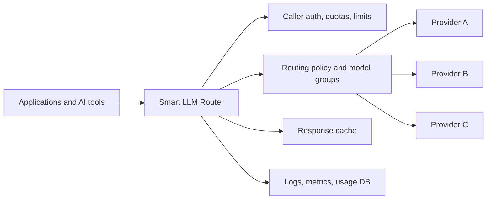
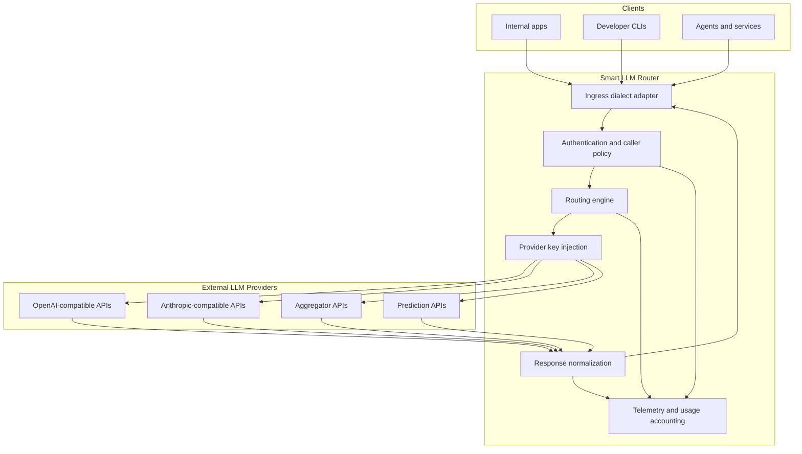
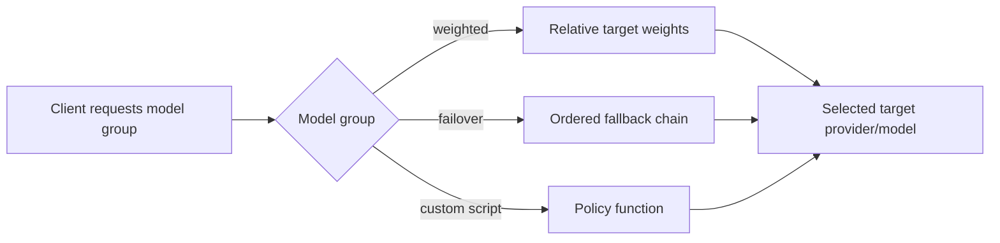
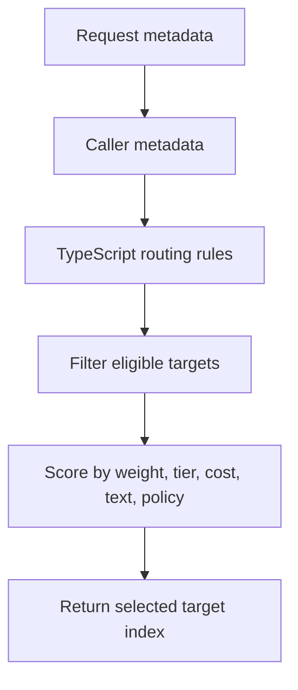
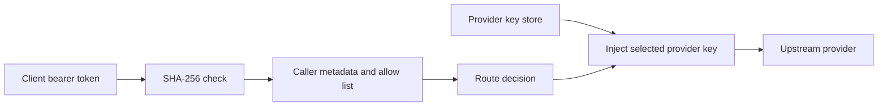
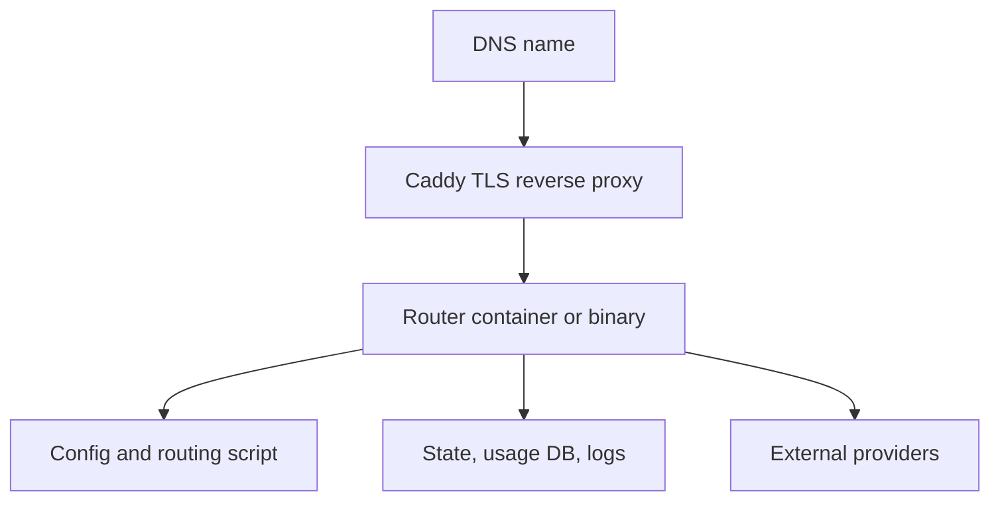

# Smart LLM Router Solution Brief

Smart LLM Router is a provider-neutral gateway for enterprise LLM traffic. It lets teams expose one controlled API endpoint to applications and developer tools while routing requests across multiple upstream model providers using policy, cost, availability, latency, caller identity, and workload-specific rules.

The result is a simpler operating model: applications integrate once, operators keep provider keys and routing policy server-side, and platform teams get consistent authentication, quotas, cache behavior, audit logs, metrics, and usage reports across heterogeneous LLM backends.

## Executive Summary

Modern AI teams often need more than one model provider. Different models may be better for coding, summarization, data extraction, low-latency chat, or high-reasoning workflows. Provider availability, pricing, rate limits, and access permissions also change over time. Hard-coding provider-specific endpoints into each application creates operational risk and makes migration expensive.

Smart LLM Router centralizes that complexity behind one internal API surface. Clients can speak OpenAI-style or Anthropic-style APIs; the router authenticates the caller, selects an allowed model group, chooses an upstream target, injects the provider credential, normalizes responses, records usage, and returns the response in the caller's expected dialect.



## What It Provides

Smart LLM Router is designed for platform teams that need a controlled, observable, multi-provider LLM layer.

Core capabilities:

- One gateway endpoint for OpenAI-compatible and Anthropic-compatible clients.
- Provider abstraction for OpenAI-style providers, Anthropic-style providers, OpenRouter-compatible routing, Replicate-style prediction APIs, and other compatible upstreams.
- Server-side provider key injection, keeping upstream credentials out of client machines and application code.
- Caller API tokens with traceable public prefixes, hashed token storage, per-caller allow lists, rate limits, quotas, and lifetime token budgets.
- Configurable model groups such as `small`, `medium`, `high`, `default`, `fast`, or `big-coder`.
- Routing strategies including static, weighted, failover, latency-oriented, cost-oriented, semantic stub classification, and TypeScript-driven custom policy.
- In-process LRU plus TTL cache for eligible unary responses.
- Structured request logs, Prometheus-compatible metrics, and SQLite-backed usage reporting.
- Markdown usage reports by time period with per-key, per-model, hourly, and daily summaries.
- Docker Compose and binary packaging for controlled deployment without shipping the source tree.

## High-Level Architecture

The router separates caller-facing contracts from provider-facing contracts. A caller can use an OpenAI Responses request while the selected target is an Anthropic-compatible provider, or use an Anthropic-style request while the router selects an OpenAI-compatible backend, subject to configured adapter support.



## Request Lifecycle

Each request follows a consistent control path:


## Routing Model

Applications request a router model group, not necessarily a concrete provider model. For example, a client might request `big-coder`, while the router decides which configured upstream model should satisfy that request.

Model groups decouple client intent from provider implementation:

- `small`: low-cost and low-latency default for routine requests.
- `medium`: balanced quality, latency, and cost.
- `high`: heavier model path for complex work.
- `fast`: optimized for lower latency and budget-aware operation.
- `big-coder`: coding-oriented failover path for agentic coding tools.
- `default`: general-purpose routing policy for common workloads.



Routing targets can include metadata such as:

- Provider name.
- Concrete provider model.
- Provider-specific dialect.
- Weight.
- Tier.
- Cost class.
- Rate hints.
- Provider key identifier.

## Configuration Overview

The router is configured with YAML plus environment-loaded provider keys. The typical deployment has:

- `config.yaml`: routing policy, providers, model groups, caller tokens, limits, cache, logs, and usage DB.
- `env.json`: provider API keys, kept outside source control.
- `router.ts`: optional TypeScript policy script for advanced routing.

Minimal shape:

```yaml
server:
  listen: :8080
  cache:
    enabled: true
    max_bytes: 134217728
    default_ttl: 15m
  logging:
    path: /app/logs/requests.jsonl
  usage_db:
    enabled: true
    path: /app/state/usage.sqlite

providers:
  openai:
    base_url: https://api.openai.com/v1
    dialect: openai-responses
    api_key: ${OPENAI_API_KEY}
    api_key_env: OPENAI_API_KEY
    key_id: openai-primary
    models:
      fast-model:
        model: example-fast-model
        tier: cheap
        weight: 10
      strong-model:
        model: example-strong-model
        tier: heavy
        weight: 3

models:
  default:
    strategy: weighted
    targets:
      - { provider: openai, model_ref: fast-model, weight: 10 }
      - { provider: openai, model_ref: strong-model, weight: 3 }

callers:
  - id: example-team-prod
    user: example-team
    project: example-project
    environment: prod
    token_sha256: SHA256_HEX_OF_ROUTER_TOKEN
    token_id: rtr_metrum_example-team_example-project_prod_k20260614
    allow: [default]
    rate: { rpm: 120, tpm: 200000, concurrent: 8 }
```

## Custom TypeScript Routing

For advanced policy, a model group can delegate selection to a TypeScript script evaluated inside the router process. The script receives safe request metadata, caller metadata, and target metadata. It does not receive raw caller tokens or raw provider API keys.

Example use cases:

- Route a specific project or token prefix to a dedicated model group.
- Bias smaller models for short prompts and larger models for complex prompts.
- Prefer a provider during business hours and another provider after hours.
- Exclude targets when the caller is not allowed to use premium models.
- Implement staged rollouts by traffic percentage.

Conceptual policy flow:



## Authentication And Key Handling

The router uses two separate credential classes:

- Caller tokens: authenticate applications and users that call the router.
- Provider keys: authenticate the router to upstream model providers.

Caller tokens are generated with a structured public prefix for traceability and a random secret suffix. The router stores and checks only SHA-256 hashes. Logs, metrics, scripts, and usage reports use public token identifiers only.

Provider keys are loaded from environment variables or an `env.json` file on the deployment host. They are injected only into outbound provider calls and are not sent to routing scripts, responses, logs, metrics, or usage reports.



## Caching

The cache is designed to reduce repeated provider calls without coupling cache entries to volatile request IDs or provider response IDs.

Cache keys are based on normalized request semantics and the selected target, including:

- Requested model group.
- Normalized prompt/messages/input.
- Generation controls such as max tokens, temperature, and stop sequences.
- Selected provider and target model.

Cache keys intentionally exclude:

- Raw request IDs.
- Router response IDs.
- Caller tokens.
- Caller user/project fields.
- Provider response IDs.
- Raw provider payload metadata.

Cache hits return a fresh router-owned response ID and do not consume provider credits or persisted caller token quota.

## Observability And Usage Reporting

Smart LLM Router produces operational data at three levels:

- Structured JSONL request logs for audit/debugging.
- Prometheus-compatible `/metrics` for dashboards and alerting.
- SQLite-backed usage DB for periodic reporting.

The `router-usage-report` tool generates markdown reports for a selected time period:

```bash
router-usage-report \
  --db /app/state/usage.sqlite \
  --log /app/logs/requests.jsonl \
  --since 24h \
  --out /app/logs/usage-24h.md
```

Reports include:

- Total calls, errors, input tokens, output tokens, and total tokens.
- Usage by internal router API key public ID, user, project, and environment.
- Usage by external provider/model.
- Usage by router model group.
- Usage by client type.
- Status-code distribution.
- Cache hit, miss, and bypass counts.
- Upstream attempts and fallback counts.
- Average and maximum latency.
- Hourly and daily usage tables.

## Deployment Options

The router can be deployed as:

- A Linux binary package with systemd and an external reverse proxy.
- A Docker Compose package with the router container plus Caddy for TLS termination.

The packaged deployment contains binaries, example config, docs, Caddy config, and routing script templates. The deployment host does not need the source repository.



## Security And Governance Posture

Smart LLM Router is intended to support enterprise control over LLM access:

- Centralized provider credential management.
- Per-caller token issuance and revocation.
- Allow lists by model group.
- Rate limits, concurrency limits, daily/monthly quotas, and lifetime budgets.
- Sanitized logs and usage reports.
- No raw provider keys in reports or routing scripts.
- No raw caller tokens in persisted telemetry.
- Public token IDs for traceability without exposing the secret suffix.

## Example Use Cases

- Give every engineering team one stable LLM endpoint while platform owners manage provider selection.
- Route coding tools to a coding-specific model group without embedding provider keys on developer machines.
- Shift traffic away from a provider when a model is unavailable or access changes.
- Run controlled model migrations behind a stable client-facing model name.
- Produce weekly usage reports by team, project, token, provider, and model.
- Keep low-risk traffic on smaller models while reserving premium models for complex workloads.

## Evaluation Checklist

When evaluating the router for a deployment, confirm:

- Which client dialects must be supported.
- Which upstream providers and models are approved.
- Which model groups should be exposed to callers.
- How caller tokens map to users, teams, projects, and environments.
- What rate limits and quota policies are required.
- Whether response caching should be enabled for the workload.
- Where logs, usage DB, and metrics will be retained.
- Which reverse proxy and TLS termination model will be used.
- How provider key rotation and caller token rotation will be handled.

